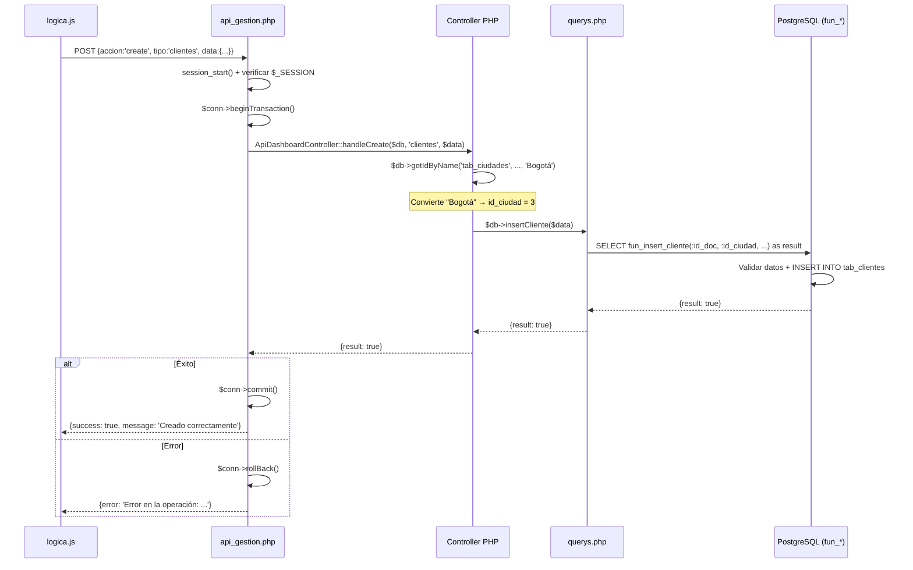

# 🗄️ Análisis de Queries del Sistema — querys.php

> Archivo: [querys.php](file:///c:/sdi/sistema/Front%20y%20Logica/src/php/querys.php) — **1650 líneas, 82KB, 40+ métodos**

---

## Catálogo Completo de Métodos

### 📖 READ (GET) — Consultas de lectura

| Método | Línea | Tablas | Complejidad | Descripción |
|--------|-------|--------|-------------|-------------|
| `getAuxiliaresJSON()` | L67 | fun_obtener_auxiliares() | ⭐ | Todos los selects en 1 JSON |
| `getIdByName()` | L78 | Dinámica | ⭐ | Traduce nombre→ID |
| `getClientes()` | L103 | 3 tablas (2 LEFT JOIN) | ⭐⭐ | Lista con doc+ciudad |
| `getEmpleados()` | L120 | 6 tablas (5 LEFT JOIN) | ⭐⭐⭐ | Lista con cargo+banco+sangre |
| `getProveedores()` | L143 | 3 tablas | ⭐⭐ | Lista con doc+ciudad |
| `getUsuarios()` | L158 | 1 tabla | ⭐ | Lista simple |
| `getInstrumentos()` | L166 | 2 tablas | ⭐⭐ | Con especialización + CASE |
| `getKits()` | L181 | 2 tablas | ⭐⭐ | Con especialización + CASE |
| `getInstrumentsByKit()` | L206 | 2 tablas (JOIN) | ⭐⭐ | Instrumentos de un kit |
| `getStats()` | L231 | fun_obtener_stats() | ⭐⭐⭐⭐ | 18 métricas del dashboard |
| `getTopVendidos()` | L254 | CTE + UNION ALL + 3 tablas | ⭐⭐⭐⭐⭐ | Top productos vendidos |
| `getAlertasDetalle()` | L310 | fun_obtener_alertas_detalle() | ⭐⭐ | Stock bajo |
| `getNuevosUsuariosMesDetalle()` | L318 | 1 tabla + EXTRACT | ⭐⭐ | Usuarios del mes |
| `buscarProductos()` | L331 | UNION ALL + 4 tablas | ⭐⭐⭐⭐ | Búsqueda catálogo tienda |
| `getProductosAdmin()` | L375 | 3 tablas + COALESCE | ⭐⭐⭐ | Productos para admin |
| `getBodega()` | L393 | 5 tablas (4 JOIN) | ⭐⭐⭐⭐ | Materiales en bodega |
| `getProduccion()` | L411 | 6 tablas (5 JOIN) | ⭐⭐⭐⭐ | Materiales en producción |
| `getKardexInstrumentos()` | L432 | 3 tablas | ⭐⭐⭐ | Historial fabricación |
| `getKardexKits()` | L446 | 3 tablas | ⭐⭐⭐ | Historial ensamblaje |
| `getKardexVentasDevoluciones()` | L1221 | UNION ALL + regex + 5 tablas | ⭐⭐⭐⭐⭐ | Ventas + devol pendientes |
| `getKardexHistory()` | L1385 | 3 tablas | ⭐⭐⭐ | Movimientos mat. prima |
| `getMateriasXCategoria()` | L1418 | 4 tablas + subconsulta | ⭐⭐⭐⭐ | Materias por categoría+precio |
| `getMateriasByProveedor()` | L1455 | 3 tablas | ⭐⭐⭐ | Stock por proveedor |
| `getFacturaEncabezado()` | L1350 | 4 tablas | ⭐⭐⭐ | Datos cabecera factura |
| `getFacturaDetalle()` | L1364 | 2 tablas | ⭐⭐ | Líneas de factura |
| `getFinanzasStats()` | L1476 | 3 queries + rentabilidad | ⭐⭐⭐⭐⭐ | Dashboard financiero |
| `getRentabilidadGlobal()` | L1522 | CROSS JOIN LATERAL | ⭐⭐⭐⭐⭐ | Cálculo utilidad |
| `getTicketEspecialidad()` | L1570 | 6 tablas + AVG + GROUP | ⭐⭐⭐⭐ | Ticket promedio |
| `getPrevisionesCompra()` | L1594 | 3 tablas + HAVING | ⭐⭐⭐⭐ | Alertas reposición |
| `getReporteFinanzasDetallado()` | L1613 | 4 tablas + string_agg | ⭐⭐⭐⭐⭐ | Reporte Excel |
| `buscarFacturasParaDevolucion()` | L1280 | 2 tablas + filtros dinámicos | ⭐⭐⭐ | Buscar facturas |

### ✏️ CREATE (INSERT)

| Método | Línea | Función SQL | Params |
|--------|-------|-------------|--------|
| `insertUser()` | L483 | `fun_insert_user` | 4 |
| `insertCliente()` | L492 | `fun_insert_cliente` | 11 |
| `insertEmpleado()` | L513 | `fun_insert_empleados` | 20 |
| `insertProveedor()` | L543 | `fun_insert_proveedor` | 8 |
| `insertCategoriaMateria()` | L561 | `fun_insert_cat_mat` | 1 |
| `insertMateriaPrima()` | L570 | `fun_insert_materia_primas` + `fun_insert_mat_prima_proveedor` | 6+7 |
| `insertInstrumento()` | L615 | `fun_insert_instrumentos` | 9 |
| `insertKit()` | L639 | `fun_insert_kits` | 8 (con array PG) |
| `insertProducto()` | L674 | `fun_insert_producto` | 5 |
| `insertKardexProducto()` | L461 | `fun_kardex_productos` | 6 |
| `registrarMovimientoKardex()` | L1132 | `fun_kardex_materia_prima` | 7 |
| `registrarVentaFormal()` | L1262 | `fun_fact` | 5 (con arrays PG) |
| `registrarDevolucionMultiple()` | L1310 | `fun_registrar_devolucion_multiple` | 5 (con arrays PG) |

### 🔄 UPDATE

| Método | Línea | Mecanismo |
|--------|-------|-----------|
| `updateGeneric()` | L941 | UPDATE dinámico (construye SET con loop) |
| `updateEmpleado()` | L867 | `fun_update_empleados` (20 params) |
| `updateCliente()` | L897 | `fun_update_clientes` (13 params) |
| `updateProveedor()` | L920 | `fun_update_proveedores` (9 params) |
| `updateKit()` | L967 | `fun_update_kits` (9 params + array) |
| `updateInstrumento()` | L1023 | `fun_update_instrumentos` (10 params) |
| `updateProducto()` | L1073 | `fun_update_producto` (6 params) |
| `updateMateriaPrima()` | L1157 | `fun_update_materias_primas` + UPSERT proveedor |
| `updateCategoriaMateria()` | L1148 | `fun_update_cat_mat_prim` |
| `updateParams()` | L295 | UPDATE directo `tab_parametros` |
| `resolverDevolucion()` | L1339 | `fun_resolver_devolucion` |

### 🗑️ DELETE (Soft Delete)

| Método | Línea | Mecanismo |
|--------|-------|-----------|
| `deleteGeneric()` | L729 | Switch por tipo → `fun_delete_*` o UPDATE directo |
| `restoreGeneric()` | L831 | `UPDATE SET ind_vivo = true` dinámico |

---

## Los 3 Patrones SQL del Sistema

### Patrón 1: SELECT directo (lecturas simples)

```php
// L158 — getUsuarios()
$sql = "SELECT u.id_user, u.nom_user, u.mail_user, u.tel_user 
        FROM tab_users u 
        WHERE u.ind_vivo = true 
        ORDER BY u.id_user ASC LIMIT 100";
return $this->conn->query($sql)->fetchAll(PDO::FETCH_ASSOC);
```

**Cuándo se usa:** Lecturas sin parámetros dinámicos del usuario.

### Patrón 2: Funciones almacenadas `fun_*` (escrituras)

```php
// L485 — insertUser()
$sql = "SELECT fun_insert_user(:nom, :pass, :tel, :mail) as result";
$stmt = $this->conn->prepare($sql);
$stmt->execute([':nom' => $nom, ':pass' => $pass, ':tel' => $tel, ':mail' => $mail]);
return $stmt->fetch(PDO::FETCH_ASSOC);
```

**Cuándo se usa:** Todas las inserciones y la mayoría de updates/deletes.
**¿Por qué?** La lógica de validación está **dentro de PostgreSQL**, no en PHP. Si la función falla, retorna `false` o lanza una excepción que PHP captura.

### Patrón 3: UPDATE genérico dinámico (fallback)

```php
// L941 — updateGeneric()
$campos = [];
$params = [':id' => $idValue, ':user' => $userSession];

foreach ($data as $key => $val) {
    $campos[] = "$key = :val_$key";       // "nom_user = :val_nom_user"
    $params[":val_$key"] = $val;
}

$sql = "UPDATE $table SET " . implode(', ', $campos) 
     . ", user_update = :user, fec_update = NOW() WHERE $idField = :id";
```

**Cuándo se usa:** Para entidades simples (usuarios) que no tienen función SQL dedicada.

---

## 🔬 Las 6 Queries Más Complejas (Para Estudiar)

---

### 1. `getRentabilidadGlobal()` — ⭐⭐⭐⭐⭐ CROSS JOIN LATERAL

📍 [Línea 1522](file:///c:/sdi/sistema/Front%20y%20Logica/src/php/querys.php#L1522-L1568)

```sql
SELECT SUM(k.cantidad * h.precio_nuevo) as total_costos
FROM tab_kardex_mat_prima k
CROSS JOIN LATERAL (
    -- Para CADA fila de kardex, busca el precio vigente
    -- en la fecha de ese movimiento
    SELECT precio_nuevo 
    FROM tab_historico_mat_prima h
    WHERE h.id_materia_prima = k.id_materia_prima 
    AND h.fecha_cambio <= k.fecha_movimiento   -- ← precio en esa fecha
    ORDER BY h.fecha_cambio DESC 
    LIMIT 1                                     -- ← el más reciente
) h
WHERE k.tipo_movimiento = 2    -- Solo salidas a producción
AND EXTRACT(YEAR FROM k.fecha_movimiento) = :y
```

**¿Por qué es compleja?** 
- `CROSS JOIN LATERAL` ejecuta una **subconsulta por cada fila** del kardex.
- Resuelve el problema de "¿cuánto costaba este material **en la fecha** en que se usó?", no al precio actual.
- Es la base del cálculo de **margen de utilidad** = ingresos − costos.

---

### 2. `getTopVendidos()` — ⭐⭐⭐⭐⭐ CTE + UNION ALL

📍 [Línea 254](file:///c:/sdi/sistema/Front%20y%20Logica/src/php/querys.php#L254-L289)

```sql
WITH sales AS (
    -- Fuente 1: Ventas formales (facturas)
    SELECT id_producto, SUM(cantidad) as total
    FROM tab_detalle_facturas
    WHERE COALESCE(ind_vivo, true) = true
    GROUP BY id_producto

    UNION ALL

    -- Fuente 2: Ventas manuales (kardex movimiento tipo 2)
    SELECT p.id_producto, SUM(k.cantidad) as total
    FROM tab_kardex_productos k
    JOIN tab_productos p ON (k.id_instrumento = p.id_instrumento 
                             OR k.id_kit = p.id_kit)
    WHERE k.tipo_movimiento = 2 
    GROUP BY p.id_producto
)
-- Consolidar ambas fuentes
SELECT p.id_producto, p.nombre_producto, p.precio_producto, p.img_url, 
       SUM(s.total) as total_vendido
FROM sales s
JOIN tab_productos p ON s.id_producto = p.id_producto
GROUP BY p.id_producto, p.nombre_producto, p.precio_producto, p.img_url
ORDER BY total_vendido DESC
LIMIT :limit
```

**¿Por qué es compleja?**
- Usa **CTE (Common Table Expression)** `WITH sales AS (...)` para unificar dos fuentes de ventas.
- El `UNION ALL` combina facturas formales + registros manuales del Kardex.
- El JOIN `ON (k.id_instrumento = p.id_instrumento OR k.id_kit = p.id_kit)` es un OR-JOIN que resuelve la dualidad instrumento/kit.

---

### 3. `getKardexVentasDevoluciones()` — ⭐⭐⭐⭐⭐ UNION ALL + Regex

📍 [Línea 1221](file:///c:/sdi/sistema/Front%20y%20Logica/src/php/querys.php#L1221-L1254)

```sql
-- Parte 1: Movimientos finalizados del kardex
(SELECT k.id_kardex_producto, ...,
       -- Extraer ID de factura del texto de observaciones con REGEX
       COALESCE(
           substring(k.observaciones from 'VENTA\\[([0-9a-zA-Z-]+)\\]'),
           substring(k.observaciones from 'DEVOLUCI\\[([0-9a-zA-Z-]+)\\]'),
           substring(k.observaciones from 'Factura #([0-9]+)')
       ) as id_factura_ref,
       'Finalizado' as estado_gestion
FROM tab_kardex_productos k
LEFT JOIN tab_instrumentos i ON k.id_instrumento = i.id_instrumento
LEFT JOIN tab_kits kit ON k.id_kit = kit.id_kit
LEFT JOIN tab_productos p ON (k.id_instrumento = p.id_instrumento OR k.id_kit = p.id_kit)
WHERE k.tipo_movimiento IN (2, 5))  -- 2=Venta, 5=Devolución

UNION ALL

-- Parte 2: Devoluciones pendientes (aún sin resolver)
(SELECT dr.id_devol_reparable, null, null, 5, dr.cantidad, ...,
       'PENDIENTE' as estado_gestion
FROM tab_devol_reparable dr
JOIN tab_productos p ON dr.id_producto = p.id_producto
WHERE dr.id_estado_devol = 1 AND dr.ind_vivo = true)

ORDER BY fecha_movimiento DESC
```

**¿Por qué es compleja?**
- Usa **regex PostgreSQL** `substring(... from 'VENTA\\[([0-9a-zA-Z-]+)\\]')` para extraer IDs de factura del texto libre de observaciones.
- Combina datos de **dos tablas estructuralmente diferentes** con `UNION ALL`, rellenando `null` donde no hay columna equivalente.
- Mezcla registros finalizados + pendientes para mostrarlos en una sola tabla.

---

### 4. `registrarVentaFormal()` — ⭐⭐⭐⭐ Arrays PostgreSQL

📍 [Línea 1262](file:///c:/sdi/sistema/Front%20y%20Logica/src/php/querys.php#L1262-L1277)

```php
// PHP construye arrays en formato PostgreSQL: "{1,5,12}"
$ids = '{' . implode(',', (array)$d['id_productos']) . '}';
$cants = '{' . implode(',', (array)$d['cantidades']) . '}';

$sql = "SELECT fun_fact(
    :id_cliente, 
    :ids::INTEGER[], 
    :cants::INTEGER[], 
    :id_pago, 
    :observaciones
) as result";
```

**¿Por qué es compleja?**
- Pasa **arrays PHP como arrays PostgreSQL** (`::INTEGER[]`), permitiendo que una sola llamada a función cree:
  1. La factura (`tab_facturas`)
  2. Múltiples líneas de detalle (`tab_detalle_facturas`)
  3. Movimientos de inventario en el kardex
  4. Actualización de stock de cada producto

---

### 5. `getReporteFinanzasDetallado()` — ⭐⭐⭐⭐⭐ Reporte Excel

📍 [Línea 1613](file:///c:/sdi/sistema/Front%20y%20Logica/src/php/querys.php#L1613-L1648)

```sql
SELECT f.id_factura as "ID Factura", 
       TO_CHAR(f.fecha_venta, 'YYYY-MM-DD HH24:MI:SS') as "Fecha",
       CASE EXTRACT(MONTH FROM f.fecha_venta)
            WHEN 1 THEN 'Enero' ... WHEN 12 THEN 'Diciembre'
       END as "Mes",
       -- Agrega TODOS los productos de la factura en una línea
       string_agg(p.nombre_producto, ', ') as "Productos Comprados",
       c.prim_nom || ' ' || c.prim_apell as "Cliente",
       f.val_tot_fact as "Total",
       CASE f.ind_forma_pago 
            WHEN 1 THEN 'Efectivo' 
            WHEN 2 THEN 'Transferencia' 
            WHEN 3 THEN 'Tarjeta' 
       END as "Medio de Pago"
FROM tab_facturas f
JOIN tab_clientes c ON f.id_cliente = c.id_cliente
LEFT JOIN tab_detalle_facturas df ON f.id_factura = df.id_factura
LEFT JOIN tab_productos p ON df.id_producto = p.id_producto
WHERE EXTRACT(YEAR FROM f.fecha_venta) = :y
GROUP BY f.id_factura, f.fecha_venta, f.val_tot_fact, 
         f.ind_forma_pago, c.id_cliente, c.prim_nom, c.prim_apell
ORDER BY f.id_factura DESC
```

**¿Por qué es compleja?**
- `string_agg(p.nombre_producto, ', ')` concatena los nombres de **todos los productos de una factura** en una sola celda.
- Los **alias con comillas dobles** (`"ID Factura"`) se usan para que los headers del Excel salgan con formato legible.
- El `GROUP BY` con 7 columnas es necesario por el `string_agg`.

---

### 6. `getMateriasXCategoria()` — ⭐⭐⭐⭐ Subconsulta Correlacionada

📍 [Línea 1418](file:///c:/sdi/sistema/Front%20y%20Logica/src/php/querys.php#L1418-L1443)

```sql
SELECT mp.*, mpp.*, p.nom_prov as proveedor,
       -- Subconsulta: obtener el ÚLTIMO precio histórico
       (SELECT precio_nuevo 
        FROM tab_historico_mat_prima h 
        WHERE h.id_materia_prima = mp.id_mat_prima 
        AND h.id_proveedor = mpp.id_prov 
        ORDER BY h.fec_insert DESC 
        LIMIT 1
       ) as precio_actual
FROM tab_materias_primas mp
LEFT JOIN tab_mat_primas_prov mpp ON mp.id_mat_prima = mpp.id_mat_prima
LEFT JOIN tab_proveedores p ON mpp.id_prov = p.id_prov
LEFT JOIN tab_unidades_medida um ON mpp.id_unidad_medida = um.id_unidad_medida
WHERE mp.id_cat_mat = :id_cat AND mp.ind_vivo = :estado
```

**¿Por qué es compleja?**
- La **subconsulta en el SELECT** se ejecuta **una vez por cada fila** del resultado principal.
- Resuelve: "Para cada materia prima, ¿cuál fue el **último precio** registrado con ese proveedor?"
- Similar en concepto al `CROSS JOIN LATERAL` de rentabilidad, pero más simple.

---

## Flujo Transaccional Completo (api_gestion.php)



> [!IMPORTANT]
> **Todas las escrituras** (create/update/delete) están envueltas en `beginTransaction()` + `commit()`/`rollBack()`. Si **cualquier** paso falla, se revierte **todo**. Esto incluye operaciones multi-paso como `insertMateriaPrima()` que hace 2 llamadas SQL.

---

## Patrones de Seguridad SQL

| Patrón | Dónde | Ejemplo |
|--------|-------|---------|
| **Prepared Statements** | Todas las queries con input | `:nom`, `:id`, `:q` |
| **Soft Delete** | `deleteGeneric()` L729 | `ind_vivo = false`, nunca `DELETE FROM` |
| **Pre-check existencia** | `deleteGeneric()` L771 | Verificar `ind_vivo` antes de marcar como borrado |
| **Audit Trail** | Constructor L46 | `SET specialized.app_user = ...` para triggers de BD |
| **Locale fijo** | Constructor L43 | `SET lc_numeric = 'C'` evita que `1.7` se lea como `17` |
| **Type casting** | Todos los inserts | `(int)`, `(float)`, `number_format()` |
| **Fallback de imagen** | `insertProducto()` L677 | Si no hay imagen, buscarla del instrumento/kit origen |
