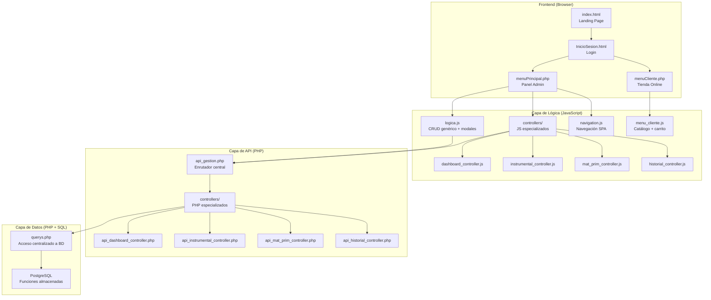
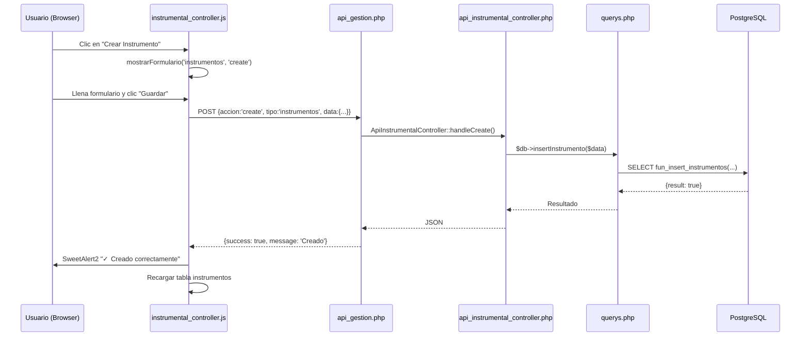

# Análisis Estructural del Proyecto — Specialized Instrumental Dental

## Resumen General

**Specialized** es un sistema de gestión de inventario e instrumental dental, construido como una aplicación web MVC con:
- **Frontend**: HTML + CSS + JavaScript vanilla (SPA parcial con carga dinámica de vistas)
- **Backend**: PHP (PDO + PostgreSQL), autenticación JWT + sesiones PHP
- **Base de Datos**: PostgreSQL con funciones almacenadas (stored procedures) para CRUD, validaciones y auditoría

El proyecto tiene **dos roles principales**: **Administrador** y **Cliente**, cada uno con su propia interfaz.

---

## Arquitectura de Alto Nivel



---

## Estructura de Directorios

```
Front y Logica/
├── index.html                          # Landing page pública
├── html/                               # Páginas HTML estáticas
│   ├── InicioSesion.html               # Login con JWT
│   ├── logout.php                      # Cierre de sesión (redirect)
│   ├── menuCliente.php                 # Redirect a src/php/menuCliente.php
│   ├── menuPrincipal.php               # Redirect a src/php/menuPrincipal.php
│   └── terminos.html                   # Términos y condiciones
│
├── styles/                             # Hojas de estilo CSS
│   ├── index.css                       # Estilos landing page
│   ├── estilos_inicio_sesion.css       # Estilos login
│   ├── estilos_menuPrincipal.css       # Estilos panel admin
│   ├── menu_clientes.css              # Estilos tienda cliente
│   ├── estilos_terminos.css            # Estilos términos
│   └── validation.css                  # Estilos de validación de formularios
│
├── images/                             # Recursos gráficos
│   ├── instrum/                        # Fotos de instrumentos (uploads)
│   ├── kit/                            # Fotos de kits (uploads)
│   ├── mat_prima/                      # Fotos de materia prima (uploads)
│   ├── prod/                           # Fotos de productos (uploads)
│   └── *.png                           # Logos y recursos estáticos
│
├── src/
│   ├── .env                            # Variables de entorno (DB creds)
│   │
│   ├── JavaScript/                     # Lógica del frontend
│   │   ├── core/                       # Módulos reutilizables
│   │   │   ├── api_service.js          # Servicio HTTP centralizado
│   │   │   ├── ui_components.js        # Componentes UI reutilizables
│   │   │   └── validadores_base.js     # Validaciones de formularios
│   │   │
│   │   ├── controllers/               # Controladores por módulo funcional
│   │   │   ├── dashboard_controller.js     # Lógica del dashboard
│   │   │   ├── instrumental_controller.js  # CRUD instrumentos y kits
│   │   │   ├── mat_prim_controller.js      # CRUD materia prima
│   │   │   └── historial_controller.js     # Kardex + ventas/devoluciones
│   │   │
│   │   ├── logica.js                  # CRUD genérico, modales, formularios dinámicos
│   │   ├── inicio_sesion.js           # Lógica del login (JWT)
│   │   ├── index.js                   # Lógica de la landing page
│   │   ├── menuPrincipal.js           # Inicialización del panel admin
│   │   ├── menu_cliente.js            # Catálogo, carrito, búsqueda
│   │   ├── navigation.js             # Navegación SPA del admin
│   │   ├── bodega_produccion.js       # Gestión bodega → producción
│   │   ├── cookies.js                 # Gestión cookies/consentimiento
│   │   ├── activity_tracker.js        # Tracking de actividad del usuario
│   │   ├── security.js               # Protección DevTools + seguridad
│   │   └── security - good.js        # Backup de seguridad
│   │
│   └── php/                           # Backend PHP
│       ├── conexion.php               # Conexión PDO a PostgreSQL
│       ├── load_env.php               # Carga de variables .env
│       ├── querys.php                 # ★ CAPA DE DATOS CENTRALIZADA (1200+ líneas)
│       ├── jwt.php                    # Generación/validación JWT
│       ├── security_headers.php       # Cabeceras HTTP de seguridad
│       │
│       ├── validar.php                # Endpoint de login (autenticación)
│       ├── registrar.php              # Endpoint de registro de usuario
│       ├── recuperar.php              # Recuperación de contraseña
│       ├── logout.php                 # Cierre de sesión seguro
│       ├── refrescar_sesion.php       # Renovación de sesión/token
│       ├── actualizarPerfil.php       # Actualización de perfil admin
│       │
│       ├── api_gestion.php            # ★ ENRUTADOR API CENTRAL (admin)
│       ├── api_productos.php          # API de productos (cliente)
│       ├── imprimir_factura.php       # Generación de facturas PDF
│       │
│       ├── menuPrincipal.php          # Vista principal del admin (MVC)
│       ├── menuCliente.php            # Vista principal del cliente (MVC)
│       │
│       ├── controllers/              # Controladores PHP por módulo
│       │   ├── dashboard_controller.php      # Lógica del dashboard
│       │   ├── api_dashboard_controller.php  # API endpoints dashboard
│       │   ├── api_instrumental_controller.php # API instrumentos/kits
│       │   ├── api_mat_prim_controller.php    # API materia prima
│       │   ├── api_historial_controller.php   # API historial/kardex
│       │   └── api_bodega_produccion.php      # API bodega/producción
│       │
│       └── includes/                 # Componentes reutilizables de vista
│           ├── header.php             # Cabecera HTML + librerías
│           ├── sidebar.php            # Menú lateral de navegación
│           └── footer.php             # Modales estándar + scripts globales
│
└── sql/                              # Funciones SQL de PostgreSQL
    ├── inserts_instalacion.sql        # Script de datos iniciales
    ├── script_instalacion_audit_trail.sql # Script de auditoría
    ├── Consultas/                    # Funciones de consulta
    │   ├── fun_obtener_stats.sql         # Estadísticas del dashboard
    │   ├── fun_obtener_auxiliares.sql     # Datos de selectores/dropdowns
    │   ├── fun_obtener_alertas_detalle.sql # Alertas de stock bajo
    │   └── fun_buscar_productos.sql      # Búsqueda del catálogo
    ├── Fun_insert/                   # 27 funciones de inserción
    ├── fun_update/                   # 33 funciones de actualización
    ├── fun_delete/                   # 34 funciones de eliminación (soft delete)
    ├── fun_transaccionales/          # Funciones de negocio complejas
    │   ├── fun_fact.sql                  # Facturación completa
    │   ├── fun_kardex_prod.sql           # Kardex de productos
    │   ├── fun_kardex_mat_prim.sql       # Kardex de materia prima
    │   ├── fun_act_precio.sql            # Actualización de precios
    │   ├── fun_caja_diario.sql           # Cierre de caja
    │   └── fun_listar_fact.sql           # Listado de facturas
    └── fun_audit_trail/              # Triggers de auditoría
        └── fun_audit_trail.sql
```

---

## Desglose por Funcionalidad

### 1. 🔐 Autenticación y Seguridad

| Componente | Archivo | Rol |
|---|---|---|
| Login | [InicioSesion.html](file:///c:/Users/Sena%20CSET/Downloads/expo%20(TODO%20AQUI)/Front%20y%20Logica/html/InicioSesion.html) + [inicio_sesion.js](file:///c:/Users/Sena%20CSET/Downloads/expo%20(TODO%20AQUI)/Front%20y%20Logica/src/JavaScript/inicio_sesion.js) | UI del login |
| Backend Login | [validar.php](file:///c:/Users/Sena%20CSET/Downloads/expo%20(TODO%20AQUI)/Front%20y%20Logica/src/php/validar.php) | Valida credenciales, genera JWT |
| JWT | [jwt.php](file:///c:/Users/Sena%20CSET/Downloads/expo%20(TODO%20AQUI)/Front%20y%20Logica/src/php/jwt.php) | Genera/valida tokens JWT |
| Registro | [registrar.php](file:///c:/Users/Sena%20CSET/Downloads/expo%20(TODO%20AQUI)/Front%20y%20Logica/src/php/registrar.php) | Registro de nuevos usuarios |
| Recuperación | [recuperar.php](file:///c:/Users/Sena%20CSET/Downloads/expo%20(TODO%20AQUI)/Front%20y%20Logica/src/php/recuperar.php) | Recuperación de contraseña |
| Logout | [logout.php](file:///c:/Users/Sena%20CSET/Downloads/expo%20(TODO%20AQUI)/Front%20y%20Logica/src/php/logout.php) | Destruye sesión + token |
| Anti-DevTools | [security.js](file:///c:/Users/Sena%20CSET/Downloads/expo%20(TODO%20AQUI)/Front%20y%20Logica/src/JavaScript/security.js) | Bloquea DevTools, right-click |
| Headers | [security_headers.php](file:///c:/Users/Sena%20CSET/Downloads/expo%20(TODO%20AQUI)/Front%20y%20Logica/src/php/security_headers.php) | CSP, HSTS, X-Frame-Options |

**Flujo**: Login → JWT token → Sesión PHP → Redirección por rol (`id_menu: 1` = Admin, `2` = Cliente)

---

### 2. 📊 Dashboard del Administrador

| Componente | Archivo | Rol |
|---|---|---|
| Vista | [menuPrincipal.php](file:///c:/Users/Sena%20CSET/Downloads/expo%20(TODO%20AQUI)/Front%20y%20Logica/src/php/menuPrincipal.php) | HTML del dashboard + tarjetas |
| Controlador PHP | [dashboard_controller.php](file:///c:/Users/Sena%20CSET/Downloads/expo%20(TODO%20AQUI)/Front%20y%20Logica/src/php/controllers/dashboard_controller.php) | Carga datos del dashboard |
| API PHP | [api_dashboard_controller.php](file:///c:/Users/Sena%20CSET/Downloads/expo%20(TODO%20AQUI)/Front%20y%20Logica/src/php/controllers/api_dashboard_controller.php) | GET/POST endpoints dashboard |
| JS Controller | [dashboard_controller.js](file:///c:/Users/Sena%20CSET/Downloads/expo%20(TODO%20AQUI)/Front%20y%20Logica/src/JavaScript/controllers/dashboard_controller.js) | Lógica interactiva del dashboard |
| SQL Stats | [fun_obtener_stats.sql](file:///c:/Users/Sena%20CSET/Downloads/expo%20(TODO%20AQUI)/Front%20y%20Logica/sql/Consultas/fun_obtener_stats.sql) | Cálculos estadísticos |

**Funcionalidades**: Tarjetas de stats (usuarios, empleados, clientes, proveedores, productos), métricas de eficiencia (lead time, conversión kits), alertas de stock, ventas diarias.

---

### 3. 🦷 Gestión de Instrumental (Instrumentos + Kits)

| Componente | Archivo | Rol |
|---|---|---|
| JS Controller | [instrumental_controller.js](file:///c:/Users/Sena%20CSET/Downloads/expo%20(TODO%20AQUI)/Front%20y%20Logica/src/JavaScript/controllers/instrumental_controller.js) (58KB) | Vista de tablas, CRUD completo, Kit Builder |
| API PHP | [api_instrumental_controller.php](file:///c:/Users/Sena%20CSET/Downloads/expo%20(TODO%20AQUI)/Front%20y%20Logica/src/php/controllers/api_instrumental_controller.php) | Endpoints instrumentos/kits |
| Datos PHP | [querys.php](file:///c:/Users/Sena%20CSET/Downloads/expo%20(TODO%20AQUI)/Front%20y%20Logica/src/php/querys.php) → `getInstrumentos()`, `getKits()`, `insertInstrumento()`, etc. | Consultas SQL |

**Entidades gestionadas**:
- `tab_instrumentos` — Instrumentos individuales (nombre, especialización, lote, tipo material, stock)
- `tab_kits` — Kits (conjuntos de instrumentos)
- `tab_instrumentos_kit` — Relación instrumentos-kit
- `tab_tipo_especializacion` — Catálogo de especializaciones (Endodoncia, Periodoncia, etc.)

---

### 4. 📦 Gestión de Materia Prima

| Componente | Archivo | Rol |
|---|---|---|
| JS Controller | [mat_prim_controller.js](file:///c:/Users/Sena%20CSET/Downloads/expo%20(TODO%20AQUI)/Front%20y%20Logica/src/JavaScript/controllers/mat_prim_controller.js) (46KB) | CRUD materia prima + categorías |
| API PHP | [api_mat_prim_controller.php](file:///c:/Users/Sena%20CSET/Downloads/expo%20(TODO%20AQUI)/Front%20y%20Logica/src/php/controllers/api_mat_prim_controller.php) | Endpoints materia prima |

**Entidades gestionadas**:
- `tab_materias_primas` — Materias primas
- `tab_cat_mat_prim` — Categorías de materia prima
- `tab_mat_primas_prov` — Relación materia prima ↔ proveedor (con lote, tipo, cantidad, unidad)
- `tab_unidades_medida` — Unidades de medida

---

### 5. 📜 Historial y Kardex

| Componente | Archivo | Rol |
|---|---|---|
| JS Controller | [historial_controller.js](file:///c:/Users/Sena%20CSET/Downloads/expo%20(TODO%20AQUI)/Front%20y%20Logica/src/JavaScript/controllers/historial_controller.js) (54KB) | Vista historial, ventas, devoluciones |
| API PHP | [api_historial_controller.php](file:///c:/Users/Sena%20CSET/Downloads/expo%20(TODO%20AQUI)/Front%20y%20Logica/src/php/controllers/api_historial_controller.php) | Endpoints historial |
| SQL Kardex | [fun_kardex_prod.sql](file:///c:/Users/Sena%20CSET/Downloads/expo%20(TODO%20AQUI)/Front%20y%20Logica/sql/fun_transaccionales/fun_kardex_prod.sql) | Movimientos de inventario productos |
| SQL Kardex MP | [fun_kardex_mat_prim.sql](file:///c:/Users/Sena%20CSET/Downloads/expo%20(TODO%20AQUI)/Front%20y%20Logica/sql/fun_transaccionales/fun_kardex_mat_prim.sql) | Movimientos de inventario materia prima |

**Funcionalidades**: Kardex de instrumentos, kardex de kits, registro de ventas (facturación), devoluciones, movimientos de bodega → producción.

---

### 6. 🏭 Bodega y Producción

| Componente | Archivo | Rol |
|---|---|---|
| JS | [bodega_produccion.js](file:///c:/Users/Sena%20CSET/Downloads/expo%20(TODO%20AQUI)/Front%20y%20Logica/src/JavaScript/bodega_produccion.js) | UI de bodega y producción |
| API PHP | [api_bodega_produccion.php](file:///c:/Users/Sena%20CSET/Downloads/expo%20(TODO%20AQUI)/Front%20y%20Logica/src/php/controllers/api_bodega_produccion.php) | Endpoints bodega |
| Datos | `querys.php` → `getBodega()`, `getProduccion()` | Consultas SQL |

**Flujo**: Materia prima → `tab_bodega` (ingreso) → `tab_producc` (producción) → Instrumental listo

---

### 7. 💰 Facturación y Ventas

| Componente | Archivo | Rol |
|---|---|---|
| SQL Facturación | [fun_fact.sql](file:///c:/Users/Sena%20CSET/Downloads/expo%20(TODO%20AQUI)/Front%20y%20Logica/sql/fun_transaccionales/fun_fact.sql) (12KB) | Proceso de facturación completa |
| Impresión | [imprimir_factura.php](file:///c:/Users/Sena%20CSET/Downloads/expo%20(TODO%20AQUI)/Front%20y%20Logica/src/php/imprimir_factura.php) | Generación de factura PDF |
| Caja diaria | [fun_caja_diario.sql](file:///c:/Users/Sena%20CSET/Downloads/expo%20(TODO%20AQUI)/Front%20y%20Logica/sql/fun_transaccionales/fun_caja_diario.sql) | Cierre de caja |
| Precios | [fun_act_precio.sql](file:///c:/Users/Sena%20CSET/Downloads/expo%20(TODO%20AQUI)/Front%20y%20Logica/sql/fun_transaccionales/fun_act_precio.sql) | Actualización de precios |

---

### 8. 🛒 Tienda del Cliente

| Componente | Archivo | Rol |
|---|---|---|
| Vista | [menuCliente.php](file:///c:/Users/Sena%20CSET/Downloads/expo%20(TODO%20AQUI)/Front%20y%20Logica/src/php/menuCliente.php) (34KB) | Tienda online completa |
| JS | [menu_cliente.js](file:///c:/Users/Sena%20CSET/Downloads/expo%20(TODO%20AQUI)/Front%20y%20Logica/src/JavaScript/menu_cliente.js) (32KB) | Catálogo, carrito, búsqueda |
| API Productos | [api_productos.php](file:///c:/Users/Sena%20CSET/Downloads/expo%20(TODO%20AQUI)/Front%20y%20Logica/src/php/api_productos.php) | Búsqueda de productos |
| SQL Búsqueda | [fun_buscar_productos.sql](file:///c:/Users/Sena%20CSET/Downloads/expo%20(TODO%20AQUI)/Front%20y%20Logica/sql/Consultas/fun_buscar_productos.sql) | Combina instrumentos + kits |

**Funcionalidades**: Catálogo con filtros por categoría, búsqueda, carrito de compras, perfil del usuario, cambio de contraseña.

---

### 9. 🔍 Auditoría (Audit Trail)

| Componente | Archivo | Rol |
|---|---|---|
| Triggers SQL | [fun_audit_trail.sql](file:///c:/Users/Sena%20CSET/Downloads/expo%20(TODO%20AQUI)/Front%20y%20Logica/sql/fun_audit_trail/fun_audit_trail.sql) | Registra todo cambio en BD |
| Script instalación | [script_instalacion_audit_trail.sql](file:///c:/Users/Sena%20CSET/Downloads/expo%20(TODO%20AQUI)/Front%20y%20Logica/sql/script_instalacion_audit_trail.sql) | Crea triggers automáticos |
| PHP | `querys.php` constructor → `SET specialized.app_user` | Registra qué usuario PHP hizo cambios |

---

### 10. 🌐 Landing Page Pública

| Componente | Archivo | Rol |
|---|---|---|
| HTML | [index.html](file:///c:/Users/Sena%20CSET/Downloads/expo%20(TODO%20AQUI)/Front%20y%20Logica/index.html) | Página de inicio con catálogo |
| JS | [index.js](file:///c:/Users/Sena%20CSET/Downloads/expo%20(TODO%20AQUI)/Front%20y%20Logica/src/JavaScript/index.js) | Carga dinámica de productos |
| CSS | [index.css](file:///c:/Users/Sena%20CSET/Downloads/expo%20(TODO%20AQUI)/Front%20y%20Logica/styles/index.css) | Estilos landing |
| Cookies | [cookies.js](file:///c:/Users/Sena%20CSET/Downloads/expo%20(TODO%20AQUI)/Front%20y%20Logica/src/JavaScript/cookies.js) | Banner de cookies |

---

## Módulos Transversales (Core)

| Módulo | Archivo | Propósito |
|---|---|---|
| API Service | [api_service.js](file:///c:/Users/Sena%20CSET/Downloads/expo%20(TODO%20AQUI)/Front%20y%20Logica/src/JavaScript/core/api_service.js) | GET/POST/FormData centralizado, manejo de sesión expirada |
| UI Components | [ui_components.js](file:///c:/Users/Sena%20CSET/Downloads/expo%20(TODO%20AQUI)/Front%20y%20Logica/src/JavaScript/core/ui_components.js) | Alertas, modales, componentes reutilizables |
| Validadores | [validadores_base.js](file:///c:/Users/Sena%20CSET/Downloads/expo%20(TODO%20AQUI)/Front%20y%20Logica/src/JavaScript/core/validadores_base.js) | Validaciones de formularios |
| Conexión BD | [conexion.php](file:///c:/Users/Sena%20CSET/Downloads/expo%20(TODO%20AQUI)/Front%20y%20Logica/src/php/conexion.php) | Conexión PDO singleton |
| Queries | [querys.php](file:///c:/Users/Sena%20CSET/Downloads/expo%20(TODO%20AQUI)/Front%20y%20Logica/src/php/querys.php) | **1200+ líneas** — Toda la capa de datos |
| Navegación | [navigation.js](file:///c:/Users/Sena%20CSET/Downloads/expo%20(TODO%20AQUI)/Front%20y%20Logica/src/JavaScript/navigation.js) | SPA routing (hash-based) |

---

## Flujo de Datos (Ejemplo: CRUD de Instrumentos)



---

## Patrones de Diseño Identificados

| Patrón | Implementación |
|---|---|
| **MVC** | Vista (`.php` + includes) / Controlador (`controllers/`) / Modelo (`querys.php`) |
| **Soft Delete** | Todos los DELETE usan `ind_vivo = false` en vez de DELETE real |
| **Stored Procedures** | Toda la lógica CRUD vive en funciones PostgreSQL (`fun_insert_*`, `fun_update_*`, `fun_delete_*`) |
| **SPA parcial** | El admin usa hash-based routing (`#instrumental`, `#materia-prima`) sin recargar página |
| **API centralizada** | Un solo punto de entrada: `api_gestion.php` → delega a controladores |
| **JWT + Sesiones** | Doble capa: JWT para transferir auth entre páginas, sesiones PHP para estado del servidor |
| **Audit Trail** | Triggers automáticos en PostgreSQL + campo `specialized.app_user` |

---

## Carpeta BACK (Duplicado/Referencia)

La carpeta `BACK/` contiene una copia de las funciones SQL con una estructura idéntica a `Front y Logica/sql/`, **más** una carpeta adicional `fun_validaciones/` con:
- `fun_valida_stock.sql` — Validación de stock disponible
- `fun_valida_cliente.sql` — Validación de datos de cliente
- `fun_valida_instrum.sql` — Validación de instrumentos
- `fun_valida_kit.sql` — Validación de kits

> [!IMPORTANT]
> La carpeta `BACK/` parece ser una **copia de respaldo o referencia** de los scripts SQL. Las funciones de validación (`fun_validaciones/`) solo existen en `BACK/`, no en `Front y Logica/sql/`.

---

## Métricas del Proyecto

| Métrica | Valor |
|---|---|
| Archivos JavaScript | ~15 archivos (~280KB total) |
| Archivos PHP | ~22 archivos |
| Archivos CSS | 6 archivos |
| Funciones SQL INSERT | 27 |
| Funciones SQL UPDATE | 33 |
| Funciones SQL DELETE | 34 |
| Funciones SQL Transaccionales | 8 |
| Funciones SQL Consulta | 4 |
| Archivo más grande | `logica.js` (69KB, 1515 líneas) |
| Capa de datos | `querys.php` (60KB, 1199 líneas) |
| Entidades principales | ~20+ tablas |
