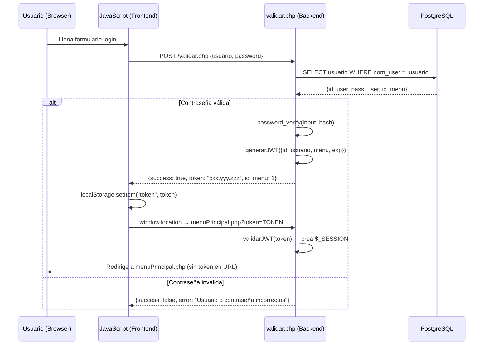
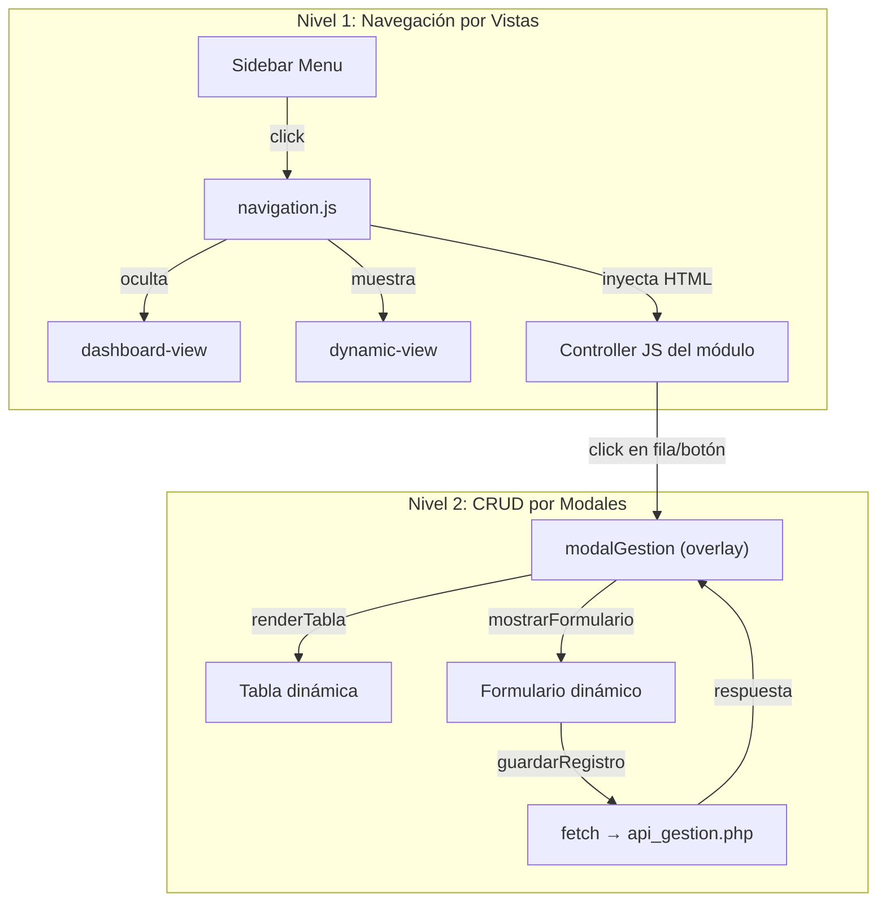
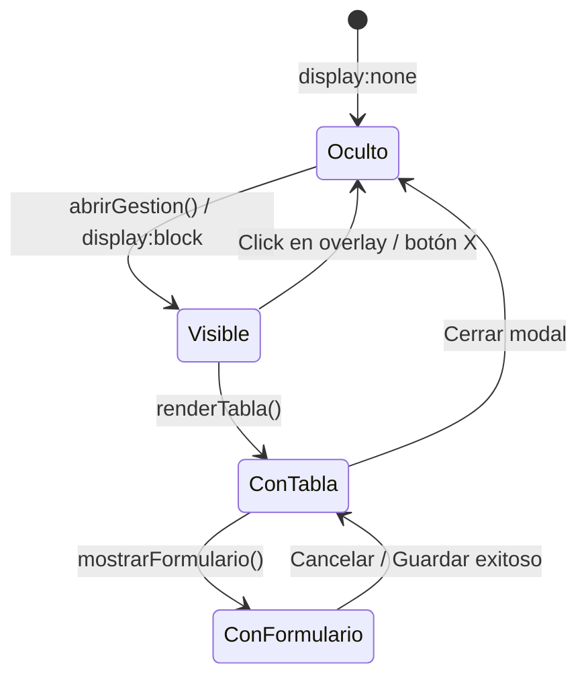
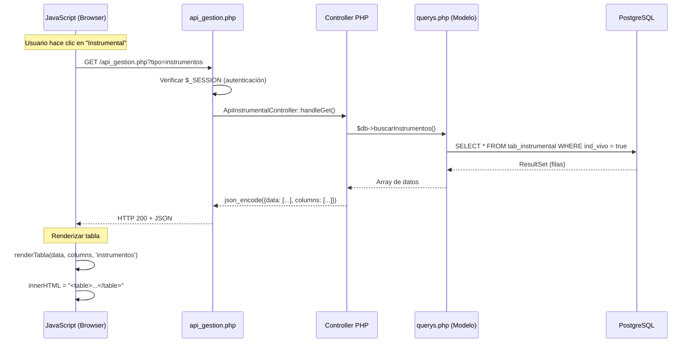
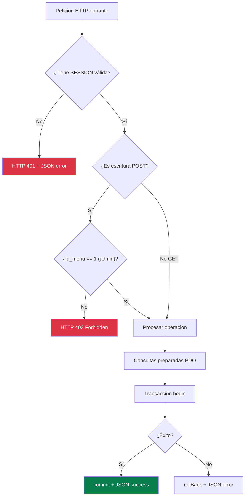
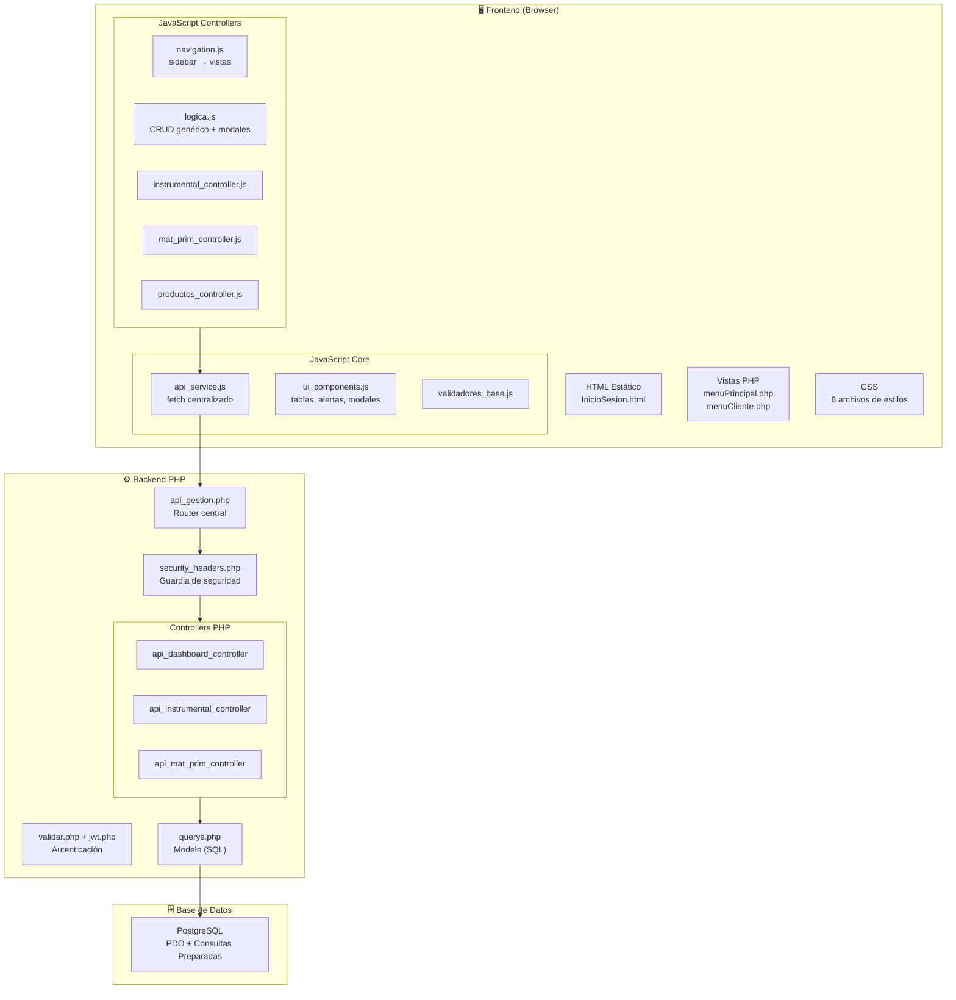

# 🏗️ Arquitectura Completa del Proyecto SDI

> Walkthrough técnico desde la perspectiva de un Arquitecto de Software Senior.
> Basado en el análisis real del código fuente del proyecto.

---

## Pilar 1: Estructura de Carpetas y Orden del Proyecto

### Tu estructura actual

```
sdi/
├── sistema/
│   ├── BACK/                          # Scripts SQL (funciones de BD)
│   │   ├── Consultas/
│   │   ├── Fun_insert/
│   │   ├── fun_delete/
│   │   ├── fun_update/
│   │   ├── fun_validaciones/
│   │   └── fun_transaccionales/
│   │
│   └── Front y Logica/                # Aplicación web completa
│       ├── index.html                 # Landing page
│       ├── html/                      # Páginas de entrada
│       │   ├── InicioSesion.html
│       │   ├── menuCliente.php        # (redirige a src/php/)
│       │   └── menuPrincipal.php      # (redirige a src/php/)
│       │
│       ├── src/
│       │   ├── php/                   # Todo el backend PHP
│       │   │   ├── conexion.php       # Conexión PDO a PostgreSQL
│       │   │   ├── jwt.php            # Generación/validación JWT
│       │   │   ├── security_headers.php
│       │   │   ├── validar.php        # Login
│       │   │   ├── registrar.php      # Registro
│       │   │   ├── querys.php         # Modelo (82KB - monolítico)
│       │   │   ├── api_gestion.php    # Router API principal
│       │   │   ├── menuPrincipal.php  # Vista admin (ensamblador)
│       │   │   ├── menuCliente.php    # Vista cliente (monolítica)
│       │   │   ├── controllers/       # Controladores por módulo
│       │   │   │   ├── api_dashboard_controller.php
│       │   │   │   ├── api_instrumental_controller.php
│       │   │   │   ├── api_mat_prim_controller.php
│       │   │   │   └── api_historial_controller.php
│       │   │   └── includes/          # Fragmentos de vista
│       │   │       ├── header.php
│       │   │       ├── sidebar.php
│       │   │       └── footer.php
│       │   │
│       │   ├── JavaScript/            # Todo el frontend JS
│       │   │   ├── core/              # Servicios reutilizables
│       │   │   │   ├── api_service.js
│       │   │   │   ├── ui_components.js
│       │   │   │   └── validadores_base.js
│       │   │   ├── controllers/       # Lógica por módulo
│       │   │   │   ├── instrumental_controller.js
│       │   │   │   ├── mat_prim_controller.js
│       │   │   │   ├── productos_controller.js
│       │   │   │   └── historial_controller.js
│       │   │   ├── logica.js          # CRUD genérico + modales admin
│       │   │   ├── menu_cliente.js    # Lógica del portal cliente
│       │   │   ├── navigation.js      # Navegación sidebar→vistas
│       │   │   └── security.js        # Protección de sesión
│       │   │
│       │   └── .env                   # Variables de entorno
│       │
│       ├── styles/                    # Hojas de estilo CSS
│       ├── images/                    # Recursos gráficos
│       └── docs/                      # Documentación
```

### Análisis: ¿Por qué está organizado así?

Tu proyecto sigue un **patrón MVC artesanal**:

| Capa | Archivos | Rol |
|------|----------|-----|
| **Modelo** | `querys.php` | Todas las consultas SQL centralizadas |
| **Vista** | `menuPrincipal.php`, `menuCliente.php`, `includes/` | HTML renderizado por PHP |
| **Controlador** | `controllers/*.php`, `api_gestion.php` | Lógica de negocio y routing |
| **Servicios JS** | `core/api_service.js`, `core/ui_components.js` | Capa de abstracción frontend |
| **Controladores JS** | `controllers/*.js` | Lógica de cada módulo en el front |

> [!TIP]
> **Fortaleza clave:** Ya separaste `core/` (servicios reutilizables) de `controllers/` (lógica de módulo) tanto en PHP como en JS. Esto es un patrón sólido.

> [!WARNING]
> **Punto de atención:** `querys.php` (82KB) es un archivo monolítico. Idealmente, cada controlador PHP debería tener su propio archivo de queries o el modelo debería dividirse por entidad.

---

## Pilar 2: Autenticación y JWT

### Diagrama del flujo completo



### Paso 1: PHP genera el JWT tras login exitoso

En [validar.php](file:///c:/sdi/sistema/Front%20y%20Logica/src/php/validar.php#L217-L232):

```php
// Se construye el payload con datos del usuario
$payload = [
    "id"      => (int) $user["id_user"],
    "usuario" => $user["nom_user"],
    "menu"    => $user["id_menu"],
    "iat"     => time(),                          // Issued At
    "exp"     => time() + ($idleMinutos * 60)      // Expiración configurable
];

$token = generarJWT($payload);

// Se devuelve al frontend como JSON
echo json_encode([
    "success" => true,
    "token"   => $token,
    "id_menu" => $user["id_menu"]
]);
```

**¿Por qué?** El token codifica la identidad del usuario en una cadena autofirmada. No necesitas consultar la BD en cada petición para saber "quién es" el usuario.

### Paso 2: JS almacena el token y navega

En [inicio_sesion.js](file:///c:/sdi/sistema/Front%20y%20Logica/src/JavaScript/inicio_sesion.js#L51-L64):

```javascript
.then(data => {
    // Guardar token en localStorage
    localStorage.setItem("token", data.token);
    
    // Redirigir según el rol (menú)
    if (Number(data.id_menu) === 1) {
        window.location.replace("../src/php/menuPrincipal.php?token=" + encodeURIComponent(data.token));
    } else if (Number(data.id_menu) === 2) {
        window.location.replace("../src/php/menuCliente.php?token=" + encodeURIComponent(data.token));
    }
})
```

### Paso 3: PHP recibe el token y crea la sesión

En [menuCliente.php](file:///c:/sdi/sistema/Front%20y%20Logica/src/php/menuCliente.php#L34-L81):

```php
$token = $_GET['token'] ?? null;

if ($token) {
    $payload = validarJWT($token);
    if ($payload && isset($payload['id'])) {
        // Token válido → crear sesión PHP
        session_regenerate_id(true);  // Prevenir Session Fixation
        $_SESSION['id_usuario'] = $payload['id'];
        $_SESSION['nom_user']   = $payload['usuario'];
        $_SESSION['id_menu']    = $payload['menu'];
        
        // Redirigir SIN token en la URL (seguridad)
        header("Location: menuCliente.php");
        exit();
    }
}
```

### Paso 4: Protección de endpoints API

En [api_gestion.php](file:///c:/sdi/sistema/Front%20y%20Logica/src/php/api_gestion.php#L32-L49):

```php
// Verificar sesión (creada en el paso anterior)
if (!isset($_SESSION['id_usuario'])) {
    http_response_code(401);
    echo json_encode(['error' => 'No autorizado']);
    exit;
}

// Verificar permisos de admin para operaciones de escritura
if ($_SERVER['REQUEST_METHOD'] !== 'GET') {
    if ($_SESSION['id_menu'] != 1) {
        http_response_code(403);
        echo json_encode(['error' => 'Acceso denegado']);
        exit;
    }
}
```

### Modelo de autenticación: JWT + Session (Híbrido)

```mermaid
flowchart LR
    A["Login exitoso"] --> B["JWT generado"]
    B --> C["Token en localStorage"]
    C --> D["Redirección con ?token="]
    D --> E["PHP valida JWT"]
    E --> F["Crea SESSION PHP"]
    F --> G["Redirige sin token en URL"]
    G --> H["APIs usan SESSION"]
    
    style B fill:#087d4e,color:white
    style F fill:#36498f,color:white
```



> [!IMPORTANT]
> **Tu sistema usa un modelo híbrido:** El JWT sirve como "puente" entre el login (stateless) y la sesión PHP (stateful). Una vez creada la sesión, las APIs validan con `$_SESSION`, no con el JWT en cada petición. El JWT en `localStorage` se usa principalmente para verificar expiración en el frontend con `verificarExpiracionTokenAdmin()`.

---

## Pilar 3: Arquitectura SPA basada en Modales

### ¿Cómo funciona la "navegación" sin cambiar de página?

Tu sistema tiene **dos niveles** de navegación, ambos sin recarga de página:



#### Nivel 1: Cambio de vistas en el sidebar

En [navigation.js](file:///c:/sdi/sistema/Front%20y%20Logica/src/JavaScript/navigation.js#L149-L211), al hacer clic en el sidebar:

```javascript
function loadView(viewName) {
    // 1. Ocultar Dashboard
    dashboardView.style.display = 'none';
    
    // 2. Mostrar contenedor dinámico y LIMPIAR previo
    dynamicView.style.display = 'block';
    dynamicView.innerHTML = '';  // ← Limpieza del DOM
    
    // 3. Expandir contenido (ocultar panel derecho)
    document.body.classList.add('expand-content');
    
    // 4. Cargar el controlador JS correspondiente
    if (viewName === 'instrumental') {
        loadSelectionView(dynamicView);   // instrumental_controller.js
    } else if (viewName === 'materia-prima') {
        loadMateriaPrimaView(dynamicView); // mat_prim_controller.js
    }
    // ... etc
}
```

**¿Por qué `innerHTML = ''`?** Cada vez que cambias de sección, se destruye el DOM anterior y se inyecta el nuevo. Esto **previene fugas de memoria** porque los nodos huérfanos son recolectados por el Garbage Collector.

#### Nivel 2: Modales para CRUD

En [logica.js](file:///c:/sdi/sistema/Front%20y%20Logica/src/JavaScript/logica.js#L184-L261), al abrir gestión:

```javascript
window.abrirGestion = async function (tipo) {
    const modalGestion = document.getElementById('modalGestion');
    const modalBody = document.getElementById('modalGestionBody');
    
    // 1. Mostrar modal con spinner de carga
    modalGestion.style.display = 'block';
    modalBody.innerHTML = '<div>Cargando datos...</div>';
    
    // 2. Fetch datos del API
    const respDatos = await fetch(`api_gestion.php?tipo=${tipo}`);
    const result = await respDatos.json();
    
    // 3. Renderizar tabla dentro del modal
    renderTabla(result.data, result.columns, tipo);
};
```

### Patrón de ciclo de vida de un modal



### Cómo se inyecta HTML dinámico (sin frameworks)

El patrón central es **Template Literals + innerHTML**:

```javascript
// En ui_components.js - renderTable()
container.innerHTML = `
    <table class="custom-table">
        <thead>
            <tr style="background: #36498f; color: white;">
                ${headerHtml}
            </tr>
        </thead>
        <tbody>
            ${rowsHtml}
        </tbody>
    </table>
`;
```

> [!NOTE]
> **Limpieza del DOM:** Al asignar `innerHTML`, el navegador destruye automáticamente los nodos hijos anteriores. Para evitar event listeners huérfanos, se usan atributos `onclick` inline en lugar de `addEventListener` en elementos efímeros (los que cambian con cada render).

---

## Pilar 4: Flujo de Datos y Generación de Tablas

### Ciclo de vida completo de la información



### Paso 1: JavaScript hace la petición (fetch)

Usando el servicio centralizado [api_service.js](file:///c:/sdi/sistema/Front%20y%20Logica/src/JavaScript/core/api_service.js#L113-L139):

```javascript
// Uso simplificado desde cualquier controller:
const result = await ApiService.fetchApiGestion('read', 'instrumentos');
// Internamente hace: fetch('./api_gestion.php?tipo=instrumentos')

// Para crear un registro:
const result = await ApiService.fetchApiGestion('create', 'instrumentos', {
    nom_instrumento: 'Explorador #5',
    id_especializacion: 3,
    cant_disp: 50
});
// Internamente hace: POST con JSON {accion:'create', tipo:'instrumentos', data:{...}}
```

### Paso 2: PHP recibe, valida y consulta

En [api_gestion.php](file:///c:/sdi/sistema/Front%20y%20Logica/src/php/api_gestion.php#L58-L76), el router:

```php
// GET → Lectura
if ($_SERVER['REQUEST_METHOD'] === 'GET') {
    $tipo = $_GET['tipo'] ?? '';
    
    // Cada controller intenta manejar el tipo
    ApiInstrumentalController::handleGet($db, $tipo, $id);
    ApiMatPrimController::handleGet($db, $tipo, $id);
    // Si ninguno hizo exit, tipo no reconocido
}

// POST → Escritura (dentro de transacción)
$conn->beginTransaction();
switch ($accion) {
    case 'create': /* ... */ break;
    case 'update': /* ... */ break;
    case 'delete': /* ... */ break;
}
$conn->commit();
```

### Paso 3: El modelo consulta la BD

En `querys.php`, los métodos usan PDO con consultas preparadas:

```php
public function buscarInstrumentos() {
    $sql = "SELECT i.id_instrumento, i.nom_instrumento, e.nom_especializacion, ...
            FROM tab_instrumental i
            JOIN tab_especializaciones e ON e.id_especializacion = i.id_especializacion
            WHERE i.ind_vivo = true
            ORDER BY i.id_instrumento";
    $stmt = $this->conn->prepare($sql);
    $stmt->execute();
    return $stmt->fetchAll(PDO::FETCH_ASSOC);
}
```

### Paso 4: JS recibe el JSON y genera la tabla

En [logica.js](file:///c:/sdi/sistema/Front%20y%20Logica/src/JavaScript/logica.js#L229-L261) — `renderTabla()`:

```javascript
window.renderTabla = function (data, columns, tipo) {
    const modalBody = document.getElementById('modalGestionBody');
    
    // 1. Construir headers desde la definición de columnas
    let html = '<table class="gestion-table"><thead><tr>';
    columns.forEach(col => { html += `<th>${col.label}</th>`; });
    html += '<th>Acciones</th></tr></thead><tbody>';
    
    // 2. Iterar datos y crear filas
    data.forEach(row => {
        const idKey = columns[0].key;  // Primera columna = PK
        html += '<tr>';
        columns.forEach(col => {
            html += `<td>${row[col.key] || ''}</td>`;
        });
        // 3. Botones de acción por fila
        html += `<td>
            <button onclick="prepararEdicion('${tipo}', ${row[idKey]})">✏️</button>
            <button onclick="eliminarRegistro('${tipo}', ${row[idKey]})">🗑️</button>
        </td></tr>`;
    });
    
    html += '</tbody></table>';
    modalBody.innerHTML = html;  // 4. Inyectar en el DOM
};
```

### Formato del JSON que devuelve PHP

```json
{
    "data": [
        {"id_instrumento": 1, "nom_instrumento": "Explorador #5", "cant_disp": 50},
        {"id_instrumento": 2, "nom_instrumento": "Espejo #4", "cant_disp": 30}
    ],
    "columns": [
        {"key": "id_instrumento", "label": "ID"},
        {"key": "nom_instrumento", "label": "Nombre"},
        {"key": "cant_disp", "label": "Cantidad"}
    ]
}
```

> [!TIP]
> **Patrón inteligente:** Las `columns` vienen desde el backend junto con los datos. Esto permite que la tabla se auto-genere sin que JS necesite conocer la estructura de cada entidad.

---

## Pilar 5: Seguridad y Encriptado de Contraseñas

### Registro: `password_hash()` con BCRYPT

En [registrar.php](file:///c:/sdi/sistema/Front%20y%20Logica/src/php/registrar.php#L117-L122):

```php
// PASSWORD_DEFAULT = BCRYPT (actualmente)
// Genera un hash irreversible con salt aleatorio incluido
$hash = password_hash($password, PASSWORD_DEFAULT);
// Resultado: "$2y$10$xQ3rJ..." (60 caracteres)
```

**¿Por qué `PASSWORD_DEFAULT` y no `PASSWORD_BCRYPT`?**
Porque si PHP en el futuro adopta un algoritmo más seguro (como Argon2id), tu código se actualiza automáticamente sin cambiar una línea.

### Login: `password_verify()` con migración automática

En [validar.php](file:///c:/sdi/sistema/Front%20y%20Logica/src/php/validar.php#L167-L197):

```php
$hashGuardado = $user["pass_user"];

// Caso A: Hash moderno (bcrypt)
if (password_get_info($hashGuardado)['algo'] !== null) {
    if (password_verify($password, $hashGuardado)) {
        $loginValido = true;
    }
}
// Caso B: Contraseña legacy (texto plano)
else {
    if (hash_equals($hashGuardado, $password)) {
        $loginValido = true;
        // ¡Migración automática al formato seguro!
        $nuevoHash = password_hash($password, PASSWORD_DEFAULT);
        $upd = $conn->prepare("UPDATE tab_users SET pass_user = :hash WHERE id_user = :id");
        $upd->execute([':hash' => $nuevoHash, ':id' => $user["id_user"]]);
    }
}
```

> [!IMPORTANT]
> **Migración transparente:** Los usuarios con contraseñas legacy en texto plano se actualizan automáticamente a bcrypt en su próximo login exitoso, sin que el usuario se entere.

### Capas de seguridad implementadas

| Capa | Implementación | Archivo |
|------|---------------|---------|
| **Contraseñas** | bcrypt via `password_hash/verify` | `registrar.php`, `validar.php` |
| **SQL Injection** | PDO con consultas preparadas | `conexion.php`, `querys.php` |
| **XSS** | `htmlspecialchars()` + función `h()` | `security_headers.php` |
| **CSRF** | Token en sesión + validación | `security_headers.php` |
| **Session Fixation** | `session_regenerate_id(true)` | `menuCliente.php` |
| **Clickjacking** | `X-Frame-Options: DENY` | `security_headers.php` |
| **MIME Sniffing** | `X-Content-Type-Options: nosniff` | `security_headers.php` |
| **CSP** | Content-Security-Policy completo | `security_headers.php` |
| **Cache** | `no-store, no-cache` en páginas protegidas | `security_headers.php` |
| **Sesión segura** | HttpOnly, SameSite=Strict, expiración | `security_headers.php` |

### Flujo de seguridad completo en una petición



---

## Resumen: Mapa Mental de la Arquitectura


