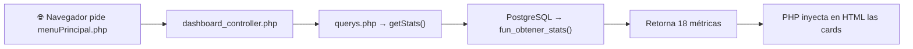
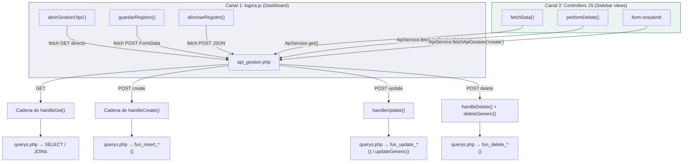

# 🔗 Cómo se Llaman las Queries desde la Página

> Cada sección traza la cadena **exacta** archivo por archivo: desde el clic hasta la query SQL.

---

## Flujo 1: Cargar el Dashboard (al entrar a menuPrincipal.php)

**Trigger:** El navegador carga `menuPrincipal.php`

```
NO hay JavaScript aquí — es PHP server-side al renderizar la página
```



**Cadena archivo por archivo:**

| Paso | Archivo | Línea | Código |
|------|---------|-------|--------|
| 1 | `menuPrincipal.php` | L3 | `require_once "controllers/dashboard_controller.php"` |
| 2 | `dashboard_controller.php` | L234 | `$db = new CQuerys()` |
| 3 | `dashboard_controller.php` | L235 | `$stats = $db->getStats()` |
| 4 | `querys.php` | L238 | `SELECT ... FROM fun_obtener_stats()` |
| 5 | `menuPrincipal.php` | L69 | `<?php echo $stats['total_clientes']; ?>` ← se inyecta en el HTML |

> [!NOTE]
> Este es el **único flujo que NO usa JavaScript**. Los números de las cards se renderizan por PHP antes de que la página llegue al navegador.

---

## Flujo 2: Click en Card "Clientes" → Modal con Tabla

**Trigger:** `onclick="abrirGestion('clientes')"` en la card

```
logica.js → fetch GET → api_gestion.php → ApiDashboardController → querys.php → PostgreSQL
```

| Paso | Archivo | Línea | Qué hace |
|------|---------|-------|----------|
| 1 | `menuPrincipal.php` | L65 | `<div onclick="abrirGestion('clientes')">` |
| 2 | `logica.js` | L199 | `fetch('api_gestion.php?tipo=clientes')` |
| 3 | `api_gestion.php` | L59 | `$tipo = $_GET['tipo']` → `'clientes'` |
| 4 | `api_gestion.php` | L63 | `ApiDashboardController::handleGet($db, 'clientes')` |
| 5 | `api_dashboard_controller.php` | L24 | `$data = $db->getClientes()` |
| 6 | `querys.php` | L105 | `SELECT c.id_cliente, ... FROM tab_clientes c LEFT JOIN tab_tipo_documentos...` |
| 7 | `api_dashboard_controller.php` | L25 | `echo json_encode(['data' => $data, 'columns' => [...]])` + `exit` |
| 8 | `logica.js` | L216 | `renderTabla(result.data, result.columns, 'clientes')` |
| 9 | `logica.js` | L250 | `modalBody.innerHTML = '<table>...'` |

---

## Flujo 3: Sidebar "Instrumental" → Ver Instrumentos como Cards

**Trigger:** Click en `#btn-instrumental` en el sidebar

```
navigation.js → instrumental_controller.js → ApiService.get() → api_gestion.php → ApiInstrumentalController → querys.php
```

| Paso | Archivo | Línea | Qué hace |
|------|---------|-------|----------|
| 1 | `sidebar.php` | L39 | `<a id="btn-instrumental">` |
| 2 | `navigation.js` | L18 | `loadView('instrumental')` |
| 3 | `navigation.js` | L162 | `loadSelectionView(dynamicView)` ← función del controller JS |
| 4 | `instrumental_controller.js` | L196 | Click en card → `loadManagementView('instrumentos')` |
| 5 | `instrumental_controller.js` | L268 | `fetchData('instrumentos')` |
| 6 | `instrumental_controller.js` | L320 | `ApiService.get('api_gestion.php?tipo=instrumentos&estado=true')` |
| 7 | `api_service.js` | L12 | `fetch(url)` → GET |
| 8 | `api_gestion.php` | L64 | `ApiInstrumentalController::handleGet($db, 'instrumentos')` |
| 9 | `api_instrumental_controller.php` | ~L15 | `$data = $db->getInstrumentos(true)` |
| 10 | `querys.php` | L168 | `SELECT i.id_instrumento... FROM tab_instrumentos i LEFT JOIN tab_tipo_especializacion...` |
| 11 | `instrumental_controller.js` | L323 | `renderGrid('instrumentos', data)` → cards con imagen |

---

## Flujo 4: Crear un Instrumento Nuevo

**Trigger:** Click en "Agregar Nuevo" → llenar form → "Guardar"

```
instrumental_controller.js → logica.js (form) → guardarRegistro() → fetch POST multipart → api_gestion.php → ApiInstrumentalController → querys.php → fun_insert_instrumentos()
```

| Paso | Archivo | Línea | Qué hace |
|------|---------|-------|----------|
| 1 | `instrumental_controller.js` | L264 | `openAddModal('instrumentos')` |
| 2 | `instrumental_controller.js` | L591 | `window.mostrarFormulario('instrumentos', 'create', null, 'local')` |
| 3 | `logica.js` | L630 | Genera `<form onsubmit="guardarRegistro(event, 'instrumentos', 'create', null, 'local')">` |
| 4 | **Usuario llena el form y da "Guardar"** | | |
| 5 | `logica.js` | L933 | `guardarRegistro(event, 'instrumentos', 'create', null, 'local')` |
| 6 | `logica.js` | L940 | `window.checkFormValidity(form)` — validación JS |
| 7 | `logica.js` | L958 | Valida imagen obligatoria para instrumentos |
| 8 | `logica.js` | L979 | `new FormData(form)` — separa datos de archivos |
| 9 | `logica.js` | L1060 | `finalFormData.append('data', JSON.stringify(dataObj))` |
| 10 | `logica.js` | L1062 | `fetch('./api_gestion.php', { method:'POST', body: finalFormData })` |
| 11 | `api_gestion.php` | L88-90 | `$accion='create', $tipo='instrumentos'` |
| 12 | `api_gestion.php` | L96 | Si hay `$_FILES['img_url']` → sube imagen a `images/instrum/` |
| 13 | `api_gestion.php` | L158 | `$conn->beginTransaction()` |
| 14 | `api_gestion.php` | L168 | `ApiInstrumentalController::handleCreate($db, 'instrumentos', $data)` |
| 15 | `api_instrumental_controller.php` | ~L80 | `$db->insertInstrumento($data)` |
| 16 | `querys.php` | L621 | `SELECT fun_insert_instrumentos(:id_espec, :nom, :cant, ...) as result` |
| 17 | `api_gestion.php` | L262 | `$conn->commit()` |
| 18 | `logica.js` | L1080 | `mostrarExitoCustom(...)` → `window.location.reload()` |

---

## Flujo 5: Eliminar un Instrumento

**Trigger:** Click en botón 🗑️ de un instrumento

```
instrumental_controller.js → ApiService.fetchApiGestion('delete') → api_gestion.php → validación dependencias → querys.php → fun_delete_instrum()
```

| Paso | Archivo | Línea | Qué hace |
|------|---------|-------|----------|
| 1 | `instrumental_controller.js` | L390 | `deleteLocal('instrumentos', 5)` |
| 2 | `instrumental_controller.js` | L542 | `UIComponents.showConfirm(...)` → SweetAlert2 |
| 3 | **Usuario confirma** | | |
| 4 | `instrumental_controller.js` | L558 | `ApiService.fetchApiGestion('delete', 'instrumentos', null, 5)` |
| 5 | `api_service.js` | L131 | `{ accion:'delete', tipo:'instrumentos', id:5 }` → POST JSON |
| 6 | `api_gestion.php` | L216 | `case 'delete':` |
| 7 | `api_gestion.php` | L220 | `ApiInstrumentalController::handleDelete($db, $conn, 'instrumentos', 5)` |
| 8 | `api_instrumental_controller.php` | ~L120 | Verifica: ¿está en un kit activo? ¿tiene producto activo? Si sí → `throw Exception` |
| 9 | `api_gestion.php` | L226 | `$db->deleteGeneric('instrumentos', 5)` |
| 10 | `querys.php` | L746 | `SELECT fun_delete_instrum(:id) as result` |
| 11 | PostgreSQL | fun_delete_instrum | `UPDATE tab_instrumentos SET ind_vivo = false WHERE id_instrumento = $1` |
| 12 | `api_gestion.php` | L262 | `$conn->commit()` |

---

## Flujo 6: Registrar Movimiento de Kardex (Inventario)

**Trigger:** Click en 📦 "Registrar Movimiento" de un instrumento

```
instrumental_controller.js → form → ApiService.fetchApiGestion('create', 'kardex_producto') → api_gestion.php → ApiHistorialController → querys.php → fun_kardex_productos()
```

| Paso | Archivo | Línea | Qué hace |
|------|---------|-------|----------|
| 1 | `instrumental_controller.js` | L384 | `openMovementModal('instrumentos', 5)` |
| 2 | `instrumental_controller.js` | L617 | Renderiza form con tipo, cantidad, observaciones |
| 3 | **Usuario llena form y da "Guardar Movimiento"** | | |
| 4 | `instrumental_controller.js` | L657 | `data = { tipo_item:1, id_item:5, tipo_movimiento:1, cantidad:10, observaciones:'...' }` |
| 5 | `instrumental_controller.js` | L667 | `ApiService.fetchApiGestion('create', 'kardex_producto', data)` |
| 6 | `api_service.js` | L131 | POST JSON → `{ accion:'create', tipo:'kardex_producto', data:{...} }` |
| 7 | `api_gestion.php` | L163 | `ApiHistorialController::handleCreate($db, 'kardex_producto', $data)` |
| 8 | `api_historial_controller.php` | ~L25 | `$db->insertKardexProducto($data)` |
| 9 | `querys.php` | L462 | `SELECT fun_kardex_productos(:tipo_item, :id_item, :tipo_mov, :cant, :obs, :jreparable) as result` |
| 10 | PostgreSQL | fun_kardex_productos | INSERT en `tab_kardex_productos` + UPDATE `cant_disp` en `tab_instrumentos` |

---

## Flujo 7: Venta Formal (Multi-producto con Factura)

**Trigger:** Modal "Registrar Movimiento" → tipo "Salida por Venta" → seleccionar producto → guardar

```
instrumental_controller.js → ApiService → api_gestion.php → ApiHistorialController → querys.php → fun_fact()
```

| Paso | Archivo | Línea | Qué hace |
|------|---------|-------|----------|
| 1 | `instrumental_controller.js` | L710 | Tipo = "Salida por Venta" → muestra selector de cliente y pago |
| 2 | `instrumental_controller.js` | L797 | `ApiService.fetchApiGestion('read', 'clientes')` → carga dropdown clientes |
| 3 | **Usuario selecciona producto, cliente, forma de pago** | | |
| 4 | `instrumental_controller.js` | ~L900 | `ApiService.fetchApiGestion('create', 'venta_formal', { id_productos:[3], cantidades:[2], id_cliente:1, id_forma_pago:1 })` |
| 5 | `api_gestion.php` | L163 | `ApiHistorialController::handleCreate($db, 'venta_formal', $data)` |
| 6 | `api_historial_controller.php` | ~L60 | `$db->registrarVentaFormal($data)` |
| 7 | `querys.php` | L1264 | `$ids = '{3}'; $cants = '{2}';` |
| 8 | `querys.php` | L1267 | `SELECT fun_fact(:id_cliente, :ids::INTEGER[], :cants::INTEGER[], :id_pago, :obs) as result` |
| 9 | PostgreSQL | fun_fact | Crea factura + líneas de detalle + movimientos kardex + actualiza stock |

---

## Resumen: Los 2 Canales de Comunicación JS→Backend



### Diferencia clave entre los 2 canales:

| | Canal 1 (logica.js) | Canal 2 (Controllers JS) |
|---|---|---|
| **Usado por** | Cards del dashboard | Sidebar views (Instrumental, Mat.Prima, etc.) |
| **Fetch** | `fetch()` directo | `ApiService.get()` / `ApiService.fetchApiGestion()` |
| **Renderizado** | `renderTabla()` → tabla HTML | `renderGrid()` → cards con imagen |
| **Modal** | `#modalGestion` (compartido) | Modal propio por módulo |
| **Tras guardar** | `window.location.reload()` | `window.location.reload()` |
