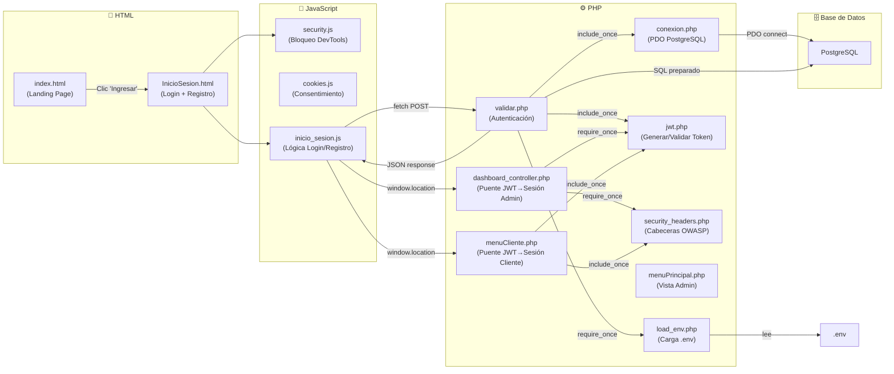
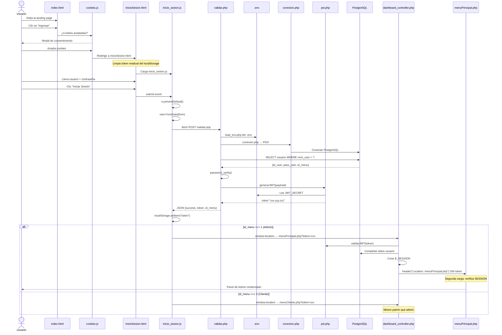

# 🔐 Flujo Completo del Inicio de Sesión — Archivo por Archivo

> Trazado exacto de cómo se conectan HTML → JS → PHP en tu proyecto SDI.

---

## Mapa de Archivos Involucrados



---

## Paso 0: El usuario llega al Landing Page

**Archivo:** [index.html](file:///c:/sdi/sistema/Front%20y%20Logica/index.html)

```html
<!-- Línea 28: El botón "Ingresar" apunta a InicioSesion.html -->
<div class="button">
    <a class="btn-link" href="./html/InicioSesion.html" target="_blank">Ingresar</a>
</div>
```

**Antes de navegar**, `cookies.js` intercepta el clic para mostrar el modal de consentimiento de cookies si no se ha aceptado antes:

```javascript
// cookies.js línea 27-34
loginLinks.forEach(link => {
    link.addEventListener('click', (e) => {
        if (!this.cookieConsent) {
            e.preventDefault();  // ← Detiene la navegación
            this.showCookieConsentModal(link.href, link.target);
        }
    });
});
```

Al aceptar/rechazar cookies, redirige a `InicioSesion.html`.

Además, al cargar index.html se **limpia cualquier token residual**:

```javascript
// index.html línea 217-220 (script inline)
if (localStorage.getItem('token')) {
    localStorage.removeItem('token');  // Limpieza de seguridad
}
```

---

## Paso 1: La página de Login se carga

**Archivo:** [InicioSesion.html](file:///c:/sdi/sistema/Front%20y%20Logica/html/InicioSesion.html)

Esta página carga **2 scripts** en este orden:

```html
<!-- Línea 9: Primero se carga security.js (bloqueo DevTools) -->
<script src="../src/JavaScript/security.js?v=99"></script>

<!-- Línea 166: Luego se carga la lógica del login (al final del body) -->
<script src="../src/JavaScript/inicio_sesion.js?v=100"></script>
```

La página tiene **dos formularios** en el mismo HTML, alternados con CSS:

| Formulario | ID | Propósito |
|---|---|---|
| Login | `loginForm` | Envía usuario + password a `validar.php` |
| Registro | `registerForm` | Envía datos a `registrar.php` |

```html
<!-- Línea 61: Formulario de Login (SIN action, lo maneja JS) -->
<form id="loginForm" method="POST" autocomplete="off">
    <input type="text" name="usuario" placeholder="Usuario" required />
    <input type="password" name="password" id="loginPassword" required />
    <button type="submit">Iniciar Sesión</button>
</form>
```

> [!IMPORTANT]
> **Nota clave:** El `loginForm` NO tiene atributo `action`. Esto significa que el formulario no navega a ninguna parte al hacer submit. Es JavaScript quien intercepta el envío con `e.preventDefault()` y usa `fetch()` para enviarlo manualmente.

Al final del HTML, un script inline **limpia tokens residuales** y bloquea el botón atrás:

```javascript
// InicioSesion.html líneas 171-195
(function () {
    // Limpia token si quedó de una sesión anterior
    if (localStorage.getItem('token')) {
        localStorage.removeItem('token');
    }
    // Bloquea el botón "atrás" del navegador
    window.history.pushState(null, null, window.location.href);
    window.onpopstate = function () {
        window.history.pushState(null, null, window.location.href);
    };
})();
```

---

## Paso 2: El usuario hace clic en "Iniciar Sesión"

**Archivo:** [inicio_sesion.js](file:///c:/sdi/sistema/Front%20y%20Logica/src/JavaScript/inicio_sesion.js#L2-L73)

JavaScript intercepta el submit del formulario:

```javascript
// Línea 2-73
document.addEventListener("DOMContentLoaded", function () {
    const form = document.getElementById("loginForm");

    if (form) {
        form.addEventListener("submit", function (e) {
            e.preventDefault();  // ← DETIENE el envío normal del formulario
            
            const formData = new FormData(form);  // Recoge usuario + password

            // Deshabilitar botón mientras se procesa
            const btn = form.querySelector('button[type="submit"]');
            btn.innerHTML = "Iniciando...";
            btn.disabled = true;

            // ══════════════════════════════════════════
            // AQUÍ SE HACE LA PETICIÓN AL BACKEND
            // ══════════════════════════════════════════
            fetch("../src/php/validar.php", {
                method: "POST",
                body: formData   // Envía: usuario=xxx&password=yyy
            })
            .then(async res => {
                // Verificar que la respuesta sea JSON válido
                const contentType = res.headers.get("content-type");
                const text = await res.text();
                
                if (contentType && contentType.includes("application/json")) {
                    data = JSON.parse(text);
                } else {
                    throw new Error("Formato de respuesta incorrecto");
                }

                if (!data.success) {
                    throw new Error(data.error || "Error en la solicitud");
                }
                return data;
            })
            .then(data => {
                // ✅ LOGIN EXITOSO
                // 1. Guardar token en localStorage
                localStorage.setItem("token", data.token);
                
                // 2. Redirigir según el rol del usuario
                const idMenu = Number(data.id_menu);
                
                if (idMenu === 1) {  // ADMINISTRADOR
                    window.location.replace(
                        "../src/php/menuPrincipal.php?token=" + encodeURIComponent(data.token)
                    );
                } else if (idMenu === 2) {  // CLIENTE
                    window.location.replace(
                        "../src/php/menuCliente.php?token=" + encodeURIComponent(data.token)
                    );
                }
            })
            .catch(err => {
                // ❌ ERROR: Mostrar mensaje y restaurar botón
                alert(err.message || "Error de conexión.");
                btn.innerHTML = originalText;
                btn.disabled = false;
            });
        });
    }
});
```

### Ruta de los archivos (relativa)

Desde `InicioSesion.html` ubicado en `html/`:

```
html/InicioSesion.html
  ↓ fetch("../src/php/validar.php")
  ↓ resuelve a:
src/php/validar.php
```

---

## Paso 3: PHP recibe la petición y autentica

**Archivo:** [validar.php](file:///c:/sdi/sistema/Front%20y%20Logica/src/php/validar.php)

### 3.1 — Cadena de dependencias (require/include)

```php
// validar.php carga estos archivos al inicio:
include_once "conexion.php";   // → carga load_env.php → lee .env
include_once "jwt.php";        // → carga load_env.php → lee JWT_SECRET del .env
```

Cadena completa de archivos que se ejecutan:

```mermaid
flowchart TD
    VP["validar.php"] -->|include_once| CX["conexion.php"]
    VP -->|include_once| JWT["jwt.php"]
    CX -->|require_once| LE["load_env.php"]
    JWT -->|require_once| LE
    LE -->|file()| ENV[".env"]
    ENV -.->|"DB_HOST, DB_NAME,<br/>DB_USER, DB_PASSWORD,<br/>JWT_SECRET"| LE
    CX -->|"new PDO()"| PG["PostgreSQL"]
```

### 3.2 — Validación paso a paso

```php
// BLOQUE 3: Solo acepta POST
if ($_SERVER["REQUEST_METHOD"] !== "POST") {
    http_response_code(405);
    exit;
}

// BLOQUE 4: Recibir datos del formulario
$usuario = trim($_POST["usuario"] ?? '');
$password = trim($_POST["password"] ?? '');

// BLOQUE 5: Conectar a la BD
$conexion = new CConexion();     // Usa conexion.php
$conn = $conexion->conexionBD(); // PDO a PostgreSQL

// BLOQUE 6: Buscar usuario con consulta preparada (anti SQL injection)
$sql = "SELECT u.id_user, u.nom_user, u.pass_user, um.id_menu
        FROM tab_users u
        INNER JOIN tab_users_menu um ON um.id_user = u.id_user
        WHERE u.nom_user = :usuario
        LIMIT 1";
$stmt = $conn->prepare($sql);
$stmt->execute([":usuario" => $usuario]);
$user = $stmt->fetch(PDO::FETCH_ASSOC);

// BLOQUE 7: Verificar contraseña
if (password_get_info($hashGuardado)['algo'] !== null) {
    // Hash moderno → password_verify
    $loginValido = password_verify($password, $hashGuardado);
} else {
    // Legacy → comparación directa + migración automática
    $loginValido = hash_equals($hashGuardado, $password);
}

// BLOQUE 8: Generar JWT y responder
$payload = [
    "id"      => (int) $user["id_user"],
    "usuario" => $user["nom_user"],
    "menu"    => $user["id_menu"],  // 1=admin, 2=cliente
    "iat"     => time(),
    "exp"     => time() + ($idleMinutos * 60)
];
$token = generarJWT($payload);   // Usa jwt.php

// Respuesta JSON al frontend
echo json_encode([
    "success" => true,
    "token"   => $token,           // "eyJhbG...xxx.yyy.zzz"
    "id_menu" => $user["id_menu"]  // 1 o 2
]);
```

### 3.3 — ¿Cómo se genera el JWT exactamente?

**Archivo:** [jwt.php](file:///c:/sdi/sistema/Front%20y%20Logica/src/php/jwt.php#L47-L70)

```php
function generarJWT(array $payload): string {
    // Parte 1: Header (fijo)
    $header = ['alg' => 'HS256', 'typ' => 'JWT'];
    $base64Header = base64url_encode(json_encode($header));
    
    // Parte 2: Payload (datos del usuario)
    $base64Payload = base64url_encode(json_encode($payload));
    
    // Parte 3: Firma (HMAC-SHA256 con clave secreta del .env)
    $signature = hash_hmac('sha256',
        $base64Header . '.' . $base64Payload,
        JWT_SECRET,  // ← Viene del .env
        true
    );
    $base64Signature = base64url_encode($signature);
    
    // Token final: header.payload.firma
    return $base64Header . '.' . $base64Payload . '.' . $base64Signature;
}
```

---

## Paso 4: JS recibe la respuesta y redirige

De vuelta en [inicio_sesion.js](file:///c:/sdi/sistema/Front%20y%20Logica/src/JavaScript/inicio_sesion.js#L51-L64):

```javascript
.then(data => {
    // 1. GUARDAR el token en el navegador
    localStorage.setItem("token", data.token);

    // 2. REDIRIGIR pasando el token como parámetro URL
    if (Number(data.id_menu) === 1) {
        // Admin → menuPrincipal.php
        window.location.replace("../src/php/menuPrincipal.php?token=" + encodeURIComponent(data.token));
    } else if (Number(data.id_menu) === 2) {
        // Cliente → menuCliente.php
        window.location.replace("../src/php/menuCliente.php?token=" + encodeURIComponent(data.token));
    }
})
```

> [!NOTE]
> `window.location.replace()` se usa en lugar de `window.location.href` para que la página de login **no quede en el historial** del navegador. Si el usuario presiona "atrás", no vuelve al login.

---

## Paso 5: PHP convierte el JWT en una sesión

### Ruta Admin: menuPrincipal.php → dashboard_controller.php

**Archivo:** [menuPrincipal.php](file:///c:/sdi/sistema/Front%20y%20Logica/src/php/menuPrincipal.php#L28) solo tiene:
```php
require_once "controllers/dashboard_controller.php";  // ← Toda la lógica está aquí
```

**Archivo:** [dashboard_controller.php](file:///c:/sdi/sistema/Front%20y%20Logica/src/php/controllers/dashboard_controller.php#L50-L99)

```php
// Sección 1: Cargar dependencias
include_once(__DIR__ . "/../security_headers.php");  // Cabeceras OWASP
include_once(__DIR__ . "/../conexion.php");
include_once(__DIR__ . "/../querys.php");
include_once(__DIR__ . "/../jwt.php");

// Sección 2: ¿Viene con ?token= en la URL?
$token = $_GET['token'] ?? null;

if ($token) {
    $payload = validarJWT($token);  // Decodificar y verificar firma

    if ($payload && isset($payload['id'])) {
        session_regenerate_id(true);  // Prevenir Session Fixation

        // Convertir datos del JWT → $_SESSION
        $_SESSION['id_usuario'] = $payload['id'];
        $_SESSION['nom_user']   = $payload['usuario'];
        $_SESSION['id_menu']    = $payload['menu'];

        // Complementar con datos de la BD (email, teléfono)
        $stmt = $conn->prepare("SELECT nom_user, mail_user, tel_user FROM tab_users WHERE id_user = :id");
        // ...

        // REDIRIGIR SIN TOKEN EN LA URL
        header("Location: menuPrincipal.php");  // ← Sin ?token=
        exit();
    } else {
        // Token inválido → volver al login
        header("Location: ../../html/InicioSesion.html");
        exit();
    }
}

// Sección 3: Si NO vino con token, verificar sesión existente
if (!isset($_SESSION['id_usuario'])) {
    header("Location: ../../html/InicioSesion.html");
    exit();
}

// Sección 7: Si pasó la autenticación, cargar datos del dashboard
$stats = $db->getStats();  // Estadísticas para las tarjetas
```

### Ruta Cliente: menuCliente.php (mismo patrón)

**Archivo:** [menuCliente.php](file:///c:/sdi/sistema/Front%20y%20Logica/src/php/menuCliente.php#L34-L81) hace exactamente lo mismo pero redirige a sí mismo sin token:

```php
header("Location: menuCliente.php");  // Sin ?token=
```

---

## Paso 6: La página protegida se renderiza

Después de la redirección limpia (sin token en URL), se ejecuta la **segunda carga** de `menuPrincipal.php`, esta vez **sin** `?token=`, por lo que entra por la Sección 3:

```php
// Ya NO hay token → verifica SESSION existente
if (!isset($_SESSION['id_usuario'])) {
    header("Location: ../../html/InicioSesion.html");  // No tiene sesión? → Login
    exit();
}

// ✅ Tiene sesión válida → cargar dashboard, estadísticas, vista...
```

Y finalmente se renderiza el HTML con los datos de PHP inyectados:

```php
// menuPrincipal.php línea 54
<h2>Bienvenido, <?php echo htmlspecialchars($nom_user); ?>!</h2>
```

---

## Diagrama del Flujo Completo (Timeline)



---

## Resumen: ¿Qué archivo hace qué?

| # | Archivo | Tipo | Responsabilidad |
|---|---------|------|-----------------|
| 1 | [index.html](file:///c:/sdi/sistema/Front%20y%20Logica/index.html#L28) | HTML | Landing page con botón "Ingresar" |
| 2 | [cookies.js](file:///c:/sdi/sistema/Front%20y%20Logica/src/JavaScript/cookies.js) | JS | Intercepta navegación para consentimiento de cookies |
| 3 | [InicioSesion.html](file:///c:/sdi/sistema/Front%20y%20Logica/html/InicioSesion.html) | HTML | Formularios de Login y Registro + limpieza de tokens |
| 4 | [security.js](file:///c:/sdi/sistema/Front%20y%20Logica/src/JavaScript/security.js) | JS | Bloqueo de DevTools (F12, Ctrl+Shift+I) |
| 5 | [inicio_sesion.js](file:///c:/sdi/sistema/Front%20y%20Logica/src/JavaScript/inicio_sesion.js) | JS | Intercepta submit, hace `fetch` a validar.php, maneja respuesta |
| 6 | [load_env.php](file:///c:/sdi/sistema/Front%20y%20Logica/src/php/load_env.php) | PHP | Lee `.env` y pone variables en `putenv()`, `$_ENV`, `$_SERVER` |
| 7 | [conexion.php](file:///c:/sdi/sistema/Front%20y%20Logica/src/php/conexion.php) | PHP | Crea conexión PDO a PostgreSQL usando credenciales del `.env` |
| 8 | [jwt.php](file:///c:/sdi/sistema/Front%20y%20Logica/src/php/jwt.php) | PHP | Genera y valida tokens JWT con HMAC-SHA256 |
| 9 | [validar.php](file:///c:/sdi/sistema/Front%20y%20Logica/src/php/validar.php) | PHP | Recibe credenciales, verifica con BD, genera JWT, responde JSON |
| 10 | [security_headers.php](file:///c:/sdi/sistema/Front%20y%20Logica/src/php/security_headers.php) | PHP | Cabeceras OWASP + configuración segura de sesión |
| 11 | [dashboard_controller.php](file:///c:/sdi/sistema/Front%20y%20Logica/src/php/controllers/dashboard_controller.php) | PHP | Convierte JWT→SESSION para admin, carga stats |
| 12 | [menuCliente.php](file:///c:/sdi/sistema/Front%20y%20Logica/src/php/menuCliente.php) | PHP | Convierte JWT→SESSION para cliente, renderiza tienda |
| 13 | [menuPrincipal.php](file:///c:/sdi/sistema/Front%20y%20Logica/src/php/menuPrincipal.php) | PHP | Ensambla la vista admin (header + sidebar + dashboard + footer) |
| 14 | [logout.php](file:///c:/sdi/sistema/Front%20y%20Logica/src/php/logout.php) | PHP | Destrucción exhaustiva de sesión en 5 pasos |

---

## La "doble carga" explicada

El patrón más importante y que puede confundir es la **doble carga** de `menuPrincipal.php` / `menuCliente.php`:

````carousel
### 🔄 Primera Carga (con token)
```
URL: menuPrincipal.php?token=eyJhbG...

1. PHP lee ?token= de la URL
2. Valida el JWT con jwt.php
3. Crea $_SESSION con los datos del token
4. header("Location: menuPrincipal.php") ← SIN token
5. exit() → El HTML NO se renderiza aún
```
<!-- slide -->
### 🏠 Segunda Carga (con sesión)
```
URL: menuPrincipal.php    ← LIMPIO, sin token

1. PHP ve que NO hay ?token=
2. Verifica $_SESSION['id_usuario'] → Existe ✅
3. Carga estadísticas del dashboard
4. Renderiza el HTML completo
5. El usuario ve el panel de administración
```
````

**¿Por qué este patrón?** Para que el token JWT **nunca quede visible** en la barra de direcciones del navegador. Si alguien toma una captura de pantalla o mira el historial, no encontrará el token.
