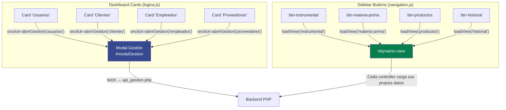
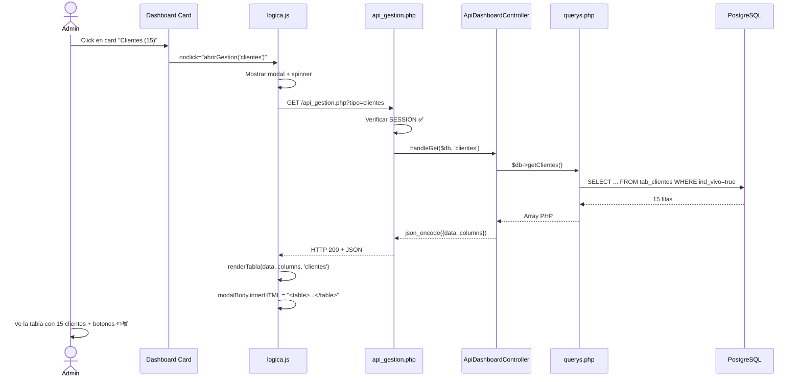
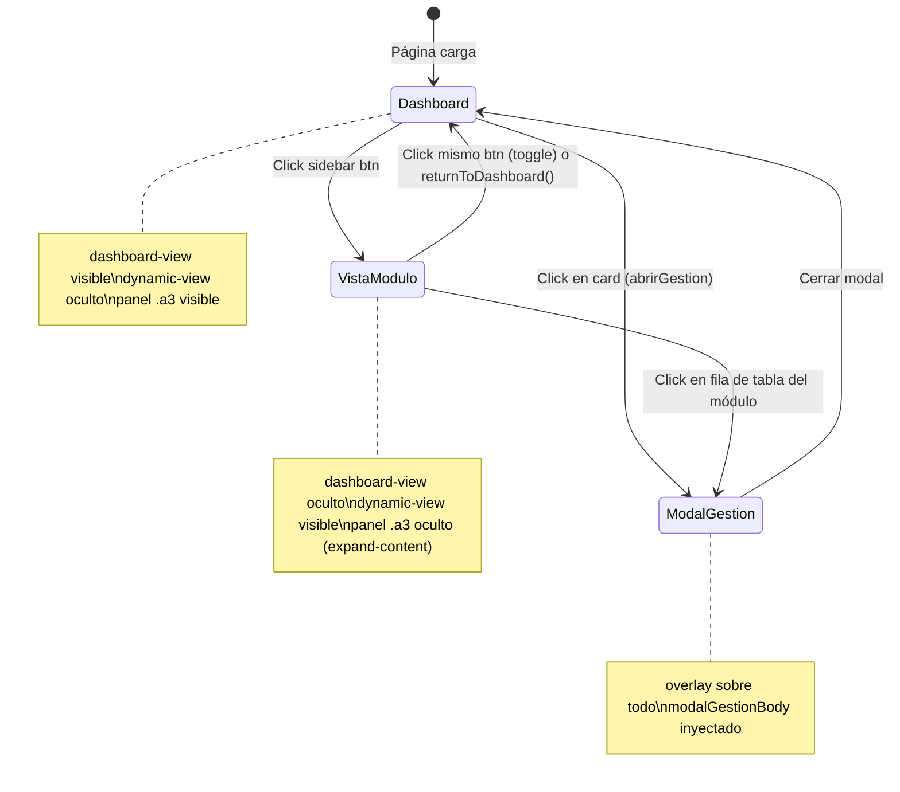

# 🖥️ Flujo de Vistas del menuPrincipal — Dashboard, Sidebar y Tablas

---

## Paso 0: Cómo se ensambla la página

[menuPrincipal.php](file:///c:/sdi/sistema/Front%20y%20Logica/src/php/menuPrincipal.php) es un **ensamblador** que une piezas:

```php
require_once "controllers/dashboard_controller.php";  // 1. Lógica + Auth + datos
include_once "includes/header.php";                     // 2. <head> CSS, SweetAlert, XLSX
include_once "includes/sidebar.php";                    // 3. Menú lateral izquierdo
// ... HTML central: dashboard-view + dynamic-view ...
include_once "includes/footer.php";                     // 4. Modales + Scripts JS
```

El HTML resultante tiene esta estructura de 3 columnas:

```
┌──────────┬─────────────────────────────────────┬──────────────┐
│  .a1     │           .a2                       │    .a3       │
│ SIDEBAR  │  dashboard-view (visible default)   │   PERFIL     │
│          │  dynamic-view   (display:none)      │   usuario    │
│ sidebar  │                                     │   opciones   │
│ .php     │  menuPrincipal.php (central)        │   stats      │
└──────────┴─────────────────────────────────────┴──────────────┘
                         ↓ footer.php ↓
          [Modales: Perfil, Password, Gestión, Soporte]
          [Scripts: api_service, ui_components, controllers, logica, navigation]
```

---

## Las dos formas de navegar (sin recargar página)



---

## Flujo A: Click en Card del Dashboard → Modal con Tabla

### Paso 1: El HTML de la card

En [menuPrincipal.php L64](file:///c:/sdi/sistema/Front%20y%20Logica/src/php/menuPrincipal.php#L64-L70):

```html
<!-- El número viene de PHP ($stats), pero el click dispara JavaScript -->
<div class="stat-card" onclick="abrirGestion('usuarios')" style="cursor: pointer;">
    <div class="stat-icon"><i class="fa-solid fa-users"></i></div>
    <div class="stat-info">
        <span class="stat-label">Total Usuarios</span>
        <span class="stat-value"><?php echo $stats['total_usuarios']; ?></span>
    </div>
</div>
```

> [!NOTE]
> El número en la card se renderiza por PHP al cargar la página (server-side). Pero al hacer **clic**, se activa JavaScript para abrir el modal y traer el detalle.

### Paso 2: `abrirGestion()` abre modal y hace fetch

En [logica.js L184-L227](file:///c:/sdi/sistema/Front%20y%20Logica/src/JavaScript/logica.js#L184-L227):

```javascript
window.abrirGestion = async function (tipo) {
    const modalGestion = document.getElementById('modalGestion');
    const modalBody = document.getElementById('modalGestionBody');
    const btnNuevo = document.getElementById('btnNuevoRegistro');

    // 1. MOSTRAR modal con spinner de carga
    modalGestion.style.display = 'block';
    modalBody.innerHTML = '<div><i class="fas fa-spinner fa-spin fa-3x"></i><p>Cargando datos...</p></div>';

    // 2. Configurar botón "Nuevo" según el tipo
    btnNuevo.setAttribute('data-tipo', tipo);
    btnNuevo.style.display = (tipo === 'nuevos_mes') ? 'none' : 'flex';

    // 3. FETCH paralelo: datos + auxiliares
    const [respDatos, _] = await Promise.all([
        fetch(`api_gestion.php?tipo=${tipo}`),   // ← GET al backend
        cargaAuxiliares()                         // ← Carga selects (ciudades, cargos...)
    ]);

    const result = await respDatos.json();

    // 4. RENDERIZAR tabla con los datos recibidos
    currentData = result.data;                    // ← Guardar referencia global
    renderTabla(result.data, result.columns, tipo);
};
```

### Paso 3: PHP recibe el GET y enruta al controller

En [api_gestion.php L58-L76](file:///c:/sdi/sistema/Front%20y%20Logica/src/php/api_gestion.php#L58-L76):

```php
// GET → Lectura de datos
if ($_SERVER['REQUEST_METHOD'] === 'GET') {
    $tipo = $_GET['tipo'] ?? '';

    // Cada controller intenta manejar el tipo.
    // Si lo reconoce, hace echo + exit. Si no, pasa al siguiente.
    ApiDashboardController::handleGet($db, $tipo);      // ← usuarios, clientes, empleados...
    ApiInstrumentalController::handleGet($db, $tipo, $id);
    ApiMatPrimController::handleGet($db, $tipo, $id);
    ApiProductosController::handleGet($db, $tipo, $id);
    ApiHistorialController::handleGet($db, $tipo, $id);
}
```

### Paso 4: El controller consulta querys.php y responde JSON

En [api_dashboard_controller.php L24-L37](file:///c:/sdi/sistema/Front%20y%20Logica/src/php/controllers/api_dashboard_controller.php#L24-L37):

```php
} else if ($tipo === 'clientes') {
    $data = $db->getClientes();           // ← Llama al MODELO (querys.php)
    echo json_encode([
        'data' => $data,                  // ← Array de filas
        'columns' => [                    // ← Definición de columnas para la tabla
            ['key' => 'id_cliente',    'label' => 'ID'],
            ['key' => 'nombre_completo', 'label' => 'Nombre'],
            ['key' => 'num_documento', 'label' => 'Documento'],
            ['key' => 'tel_cliente',   'label' => 'Teléfono'],
            ['key' => 'dir_cliente',   'label' => 'Dirección'],
            ['key' => 'ind_profesion', 'label' => 'Profesión']
        ]
    ]);
    exit;   // ← IMPORTANTE: exit detiene la cadena de controllers
}
```

> [!IMPORTANT]
> **Patrón "cadena de responsabilidad":** Cada controller verifica si el `$tipo` le corresponde. Si sí, hace `echo` + `exit`. Si no, la ejecución continúa al siguiente controller. El último `echo` antes de `exit` en `api_gestion.php` dice "Tipo no válido".

### Paso 5: JS recibe el JSON y genera la tabla HTML

En [logica.js L229-L261](file:///c:/sdi/sistema/Front%20y%20Logica/src/JavaScript/logica.js#L229-L261):

```javascript
window.renderTabla = function (data, columns, tipo) {
    const modalBody = document.getElementById('modalGestionBody');

    // Sin datos → mensaje vacío
    if (!data || data.length === 0) {
        modalBody.innerHTML = '<div>No hay registros. ¡Crea el primero!</div>';
        return;
    }

    // Construir tabla HTML con template literals
    let html = '<table class="gestion-table"><thead><tr>';
    columns.forEach(col => { html += `<th>${col.label}</th>`; });
    html += '<th>Acciones</th></tr></thead><tbody>';

    data.forEach(row => {
        const idKey = columns[0].key;  // Primera columna = PK (id_cliente, id_user...)
        html += '<tr>';
        columns.forEach(col => { html += `<td>${row[col.key] || ''}</td>`; });
        html += `<td>
            <button onclick="prepararEdicion('${tipo}', ${row[idKey]})">✏️</button>
            <button onclick="eliminarRegistro('${tipo}', ${row[idKey]})">🗑️</button>
        </td></tr>`;
    });

    html += '</tbody></table>';
    modalBody.innerHTML = html;   // ← INYECTAR en el DOM del modal
};
```

### Diagrama de secuencia completo (Card → Tabla)



---

## Flujo B: Click en Sidebar → Vista Dinámica

### Paso 1: El sidebar genera botones con IDs

En [sidebar.php L38-L43](file:///c:/sdi/sistema/Front%20y%20Logica/src/php/includes/sidebar.php#L38-L43):

```html
<a href="#instrumental" id="btn-instrumental">
    <div class="menu">
        <h2>Instrumental</h2>
        <i class="fa-solid fa-tools"></i>
    </div>
</a>
```

### Paso 2: navigation.js escucha los clicks

En [navigation.js L18-L29](file:///c:/sdi/sistema/Front%20y%20Logica/src/JavaScript/navigation.js#L18-L29):

```javascript
if (btnInstrumental) {
    btnInstrumental.addEventListener('click', (e) => {
        e.preventDefault();
        const menuDiv = btnInstrumental.querySelector('.menu');
        if (menuDiv && menuDiv.classList.contains('active-menu')) {
            returnToDashboard();  // Si ya está activo → volver al dashboard
        } else {
            activateMenu(btnInstrumental);  // Marcar como activo
            loadView('instrumental');        // Cargar la vista
        }
    });
}
```

### Paso 3: `loadView()` intercambia las vistas en el DOM

En [navigation.js L149-L211](file:///c:/sdi/sistema/Front%20y%20Logica/src/JavaScript/navigation.js#L149-L211):

```javascript
function loadView(viewName) {
    // 1. OCULTAR dashboard (las cards de estadísticas)
    dashboardView.style.display = 'none';

    // 2. MOSTRAR contenedor dinámico y LIMPIAR el previo
    dynamicView.style.display = 'block';
    dynamicView.innerHTML = '';     // Destruir DOM anterior

    // 3. Expandir: ocultar panel derecho (.a3) para más espacio
    document.body.classList.add('expand-content');

    // 4. Delegar al CONTROLLER JS del módulo
    if (viewName === 'instrumental') {
        loadSelectionView(dynamicView);         // instrumental_controller.js
    } else if (viewName === 'materia-prima') {
        loadMateriaPrimaView(dynamicView);      // mat_prim_controller.js
    } else if (viewName === 'productos') {
        loadProductosView(dynamicView);         // productos_controller.js
    } else if (viewName === 'historial') {
        loadHistorialView(dynamicView);         // historial_controller.js
    } else if (viewName === 'finanzas') {
        loadFinanzasView(dynamicView);          // finanzas_controller.js
    } else {
        renderPlaceholder(dynamicView, viewName);
    }
}
```

### Paso 4: `returnToDashboard()` restaura el estado original

En [navigation.js L215-L249](file:///c:/sdi/sistema/Front%20y%20Logica/src/JavaScript/navigation.js#L215-L249):

```javascript
window.returnToDashboard = function () {
    // 1. Ocultar vista dinámica
    dynamicView.style.display = 'none';
    dynamicView.innerHTML = '';      // Limpiar DOM

    // 2. Mostrar dashboard con animación
    dashboardView.style.display = 'block';
    dashboardView.classList.add('fade-in');

    // 3. Desactivar todos los menús del sidebar
    menuItems.forEach(item => item.classList.remove('active-menu'));

    // 4. Restaurar panel derecho
    document.body.classList.remove('expand-content');
};
```



---

## Flujo C: CRUD completo (Crear/Editar/Eliminar)

### Crear un registro

```mermaid
sequenceDiagram
    actor U as Admin
    participant BTN as Botón "Nuevo"
    participant JS as logica.js
    participant FORM as Formulario HTML dinámico
    participant API as api_gestion.php
    participant CTRL as Controller PHP
    participant DB as PostgreSQL

    U->>BTN: Click "+ Nuevo"
    BTN->>JS: mostrarFormulario(tipo, 'create')
    JS->>JS: Genera HTML del formulario con auxiliares
    JS->>FORM: modalBody.innerHTML = "<form>..."
    U->>FORM: Llena campos + selecciona imagen
    U->>FORM: Click "Guardar"
    FORM->>JS: guardarRegistro(event, tipo, 'create', null)
    JS->>JS: Validar campos + validar imagen
    JS->>JS: new FormData() + separar archivos de datos
    JS->>API: POST multipart/form-data {accion:'create', tipo, data}
    API->>API: SESSION ✅ + es Admin ✅
    API->>API: beginTransaction()
    API->>CTRL: handleCreate($db, tipo, data)
    CTRL->>DB: INSERT via consulta preparada
    DB-->>CTRL: OK
    API->>API: commit()
    API-->>JS: {success: true}
    JS->>JS: mostrarExitoCustom()
    JS->>JS: window.location.reload()
```



### Estructura del POST que envía `guardarRegistro`:

```javascript
// logica.js L978-L1064
const finalFormData = new FormData();
finalFormData.append('accion', 'create');          // create | update | delete
finalFormData.append('tipo', 'clientes');           // entidad
finalFormData.append('id', 5);                      // solo para update/delete
finalFormData.append('data', JSON.stringify({       // datos del formulario como JSON
    nom_cliente: "Juan Pérez",
    tel_cliente: "3001234567",
    nom_ciudad: "Bucaramanga"                       // nombre, no ID
}));
finalFormData.append('img_url', File);              // imagen si aplica
```

### Cómo PHP convierte nombres a IDs

En [api_dashboard_controller.php L136-L148](file:///c:/sdi/sistema/Front%20y%20Logica/src/php/controllers/api_dashboard_controller.php#L136-L148):

```php
// El formulario envía "Bucaramanga" (texto), pero la BD necesita el ID
$data['id_ciudad'] = $db->getIdByName(
    'tab_ciudades',          // tabla
    'id_ciudad',             // columna ID
    'nom_ciudad',            // columna nombre
    $data['nom_ciudad']      // valor: "Bucaramanga" → retorna: 3
);

if (!$data['id_ciudad'])
    throw new Exception("Ciudad inválida");

return $db->insertCliente($data);
```

---

## Resumen: Mapa de archivos por capa

| Capa | Archivo | Responsabilidad |
|------|---------|-----------------|
| **Vista (ensamblaje)** | [menuPrincipal.php](file:///c:/sdi/sistema/Front%20y%20Logica/src/php/menuPrincipal.php) | Une header + sidebar + central + footer |
| **Vista (head)** | [header.php](file:///c:/sdi/sistema/Front%20y%20Logica/src/php/includes/header.php) | CSS, SweetAlert2, XLSX, Font Awesome |
| **Vista (sidebar)** | [sidebar.php](file:///c:/sdi/sistema/Front%20y%20Logica/src/php/includes/sidebar.php) | 5 botones de navegación con IDs |
| **Vista (modales+scripts)** | [footer.php](file:///c:/sdi/sistema/Front%20y%20Logica/src/php/includes/footer.php) | 8 modales + carga de todos los JS + logout |
| **Controlador (auth+datos)** | [dashboard_controller.php](file:///c:/sdi/sistema/Front%20y%20Logica/src/php/controllers/dashboard_controller.php) | JWT→Session, stats, auxiliares |
| **Router API** | [api_gestion.php](file:///c:/sdi/sistema/Front%20y%20Logica/src/php/api_gestion.php) | Recibe GET/POST, valida sesión, delega a controllers |
| **API Controllers** | [api_dashboard_controller.php](file:///c:/sdi/sistema/Front%20y%20Logica/src/php/controllers/api_dashboard_controller.php) | CRUD de usuarios, clientes, empleados, proveedores |
| **Modelo** | querys.php | SQL preparado para todas las entidades |
| **JS Navegación** | [navigation.js](file:///c:/sdi/sistema/Front%20y%20Logica/src/JavaScript/navigation.js) | Toggle dashboard↔dynamic-view desde sidebar |
| **JS CRUD** | [logica.js](file:///c:/sdi/sistema/Front%20y%20Logica/src/JavaScript/logica.js) | abrirGestion, renderTabla, mostrarFormulario, guardarRegistro |
| **JS Servicios** | [api_service.js](file:///c:/sdi/sistema/Front%20y%20Logica/src/JavaScript/core/api_service.js) | Wrapper fetch centralizado |
| **JS UI** | [ui_components.js](file:///c:/sdi/sistema/Front%20y%20Logica/src/JavaScript/core/ui_components.js) | Alertas, spinners, session expired |

### Orden de carga de scripts (definido en footer.php L455-L468):

```
1. api_service.js        ← fetch wrapper
2. ui_components.js      ← alertas y spinners
3. validadores_base.js   ← validación de formularios
4. instrumental_controller.js  ← vista Instrumental
5. mat_prim_controller.js      ← vista Materia Prima
6. historial_controller.js     ← vista Historial
7. productos_controller.js     ← vista Productos
8. finanzas_controller.js      ← vista Finanzas
9. dashboard_controller.js     ← lógica cards dashboard
10. navigation.js              ← sidebar toggle
11. logica.js                  ← CRUD genérico + modales
```
